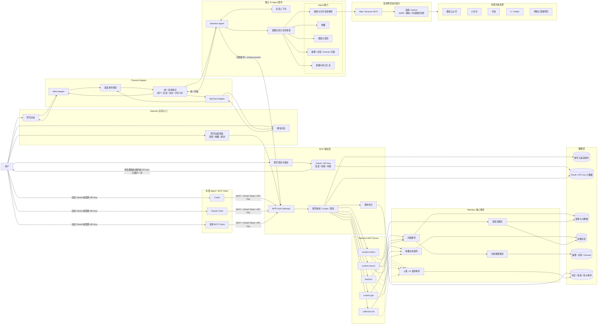
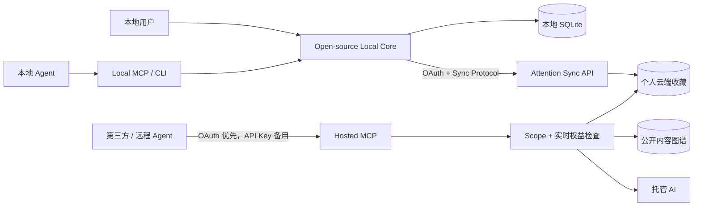
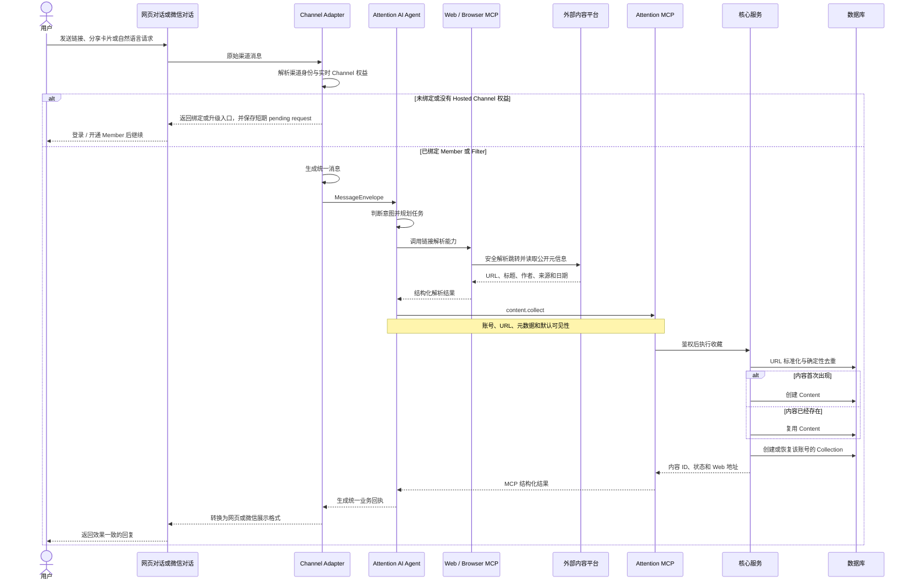
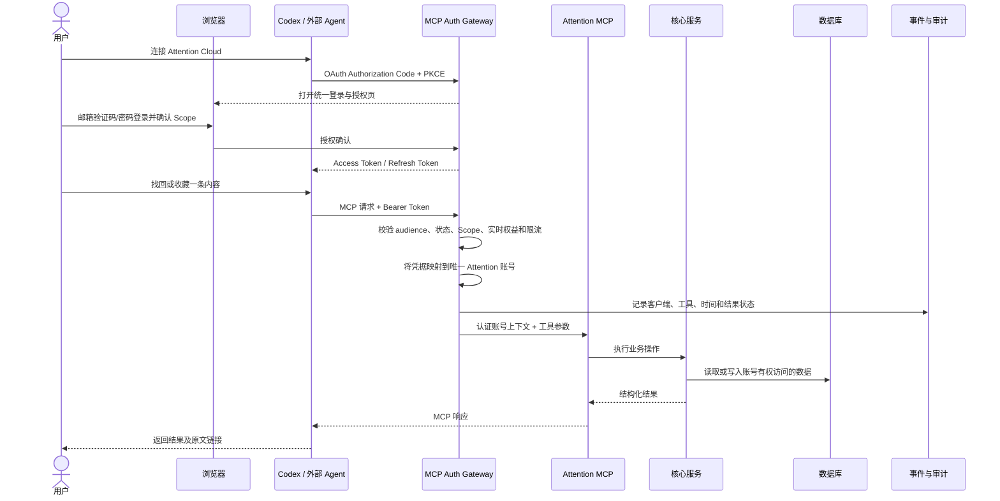

# Attention 系统架构

状态：长期目标架构；账号、连接与增长账本首版已实现

更新日期：2026-08-04

账号、Free/Member、OAuth、Local/Cloud、Hosted MCP 和增长权益的产品边界以 [`docs/superpowers/specs/2026-08-04-attention-identity-membership-growth-design.md`](./superpowers/specs/2026-08-04-attention-identity-membership-growth-design.md) 为准。

当前交付顺序以 [`Attention Core-first Agent 路线设计`](./superpowers/specs/2026-08-04-attention-core-first-agent-roadmap-design.md) 为准：第一阶段先向 Filter 和项目方自己的 AI 开放 Core/MCP/Skill；企业微信客服和官方 Hosted Agent 后移，并以真实使用数据完成选型和建设。下方 Hosted Agent 与 Channel 图表示长期目标，不表示第一阶段全部实现。

## 1. 架构原则

1. 网页和微信只是不同的交互渠道，不分别实现内容理解和收藏逻辑；但 Channel 可以有独立的接入权益门槛。
2. 独立的 Attention AI Agent 统一负责对话、意图判断、任务规划和链接解析。已经通过渠道身份与权益前置检查的请求，应在网页和微信中得到一致的 Agent/MCP 业务结果。
3. 链接解析是 Agent 的能力。Agent 可调用受控的 Web/Browser MCP 访问公开网页、还原跳转并提取元数据。
4. Attention MCP 是 Agent 业务能力的统一入口；离线增量同步使用独立 Sync API，不把数据复制协议永久绑定在 MCP 上。
5. Codex、Claude Code 等外部 Agent 优先通过 OAuth Authorization Code + PKCE 连接 Hosted MCP；API Key 只作为不支持浏览器 OAuth 时的备用。所有 Key 类型相同，实际能力按账号实时权益计算；OAuth 仍受用户授权 Scope 约束。
6. 开源 Local Core、CLI、Local MCP 与 Skill 无需账号即可运行；Free 可连接云同步和 Hosted MCP 个人收藏能力，Member 获得托管 AI、完整公开流、Member 专属 MCP 能力与 Hosted Channel。
7. Attention 不保存原文，只保存链接、必要元数据、AI 派生信息、收藏关系和使用事件；阅读始终回到原作者和原平台。

> 内容采集链路仍有一组未封口问题：当前静态 Fetcher、规则解析、未来 Browser Worker 与 AI Content Processor 如何判断“信息足够”，以及 Runtime 网页工具如何承载 Agent 的自主控制循环，尚未形成最终设计。长期方向已确认由 Hosted Agent 作为逻辑规划者，但当前 Fetcher HTTP 合同不得直接视为 Agent Tool Contract。详见 [`内容采集与 AI 预处理：待设计议题`](./content-acquisition-open-questions.md)。

## 2. 总体架构

### 2.1 Local、Cloud 与同步边界

- Local only 无需账号或 token，数据可以只保存在本地。
- Free 通过 OAuth 或 API Key 连接云端，可同步和读写自己的收藏。
- Member 在相同连接上获得托管 AI、完整公开流、筛选订阅和 Member 专属 MCP 能力。
- Sync API 负责 mutation log、cursor、批量传输、幂等与冲突处理；Hosted MCP 负责 Agent 工具调用。
- Hosted MCP 对外公开并不表示匿名访问。Guest 不能连接，Free/Member 能力由服务端实时判断。
- Guest、Free 或其他没有完整公开流权益的账号受服务端 `public_feed_preview_limit` 限制，MCP 不能绕过网页的内容边界。

### 2.2 当前账号、凭据与连接实现

以下凭据彼此独立，任何一种吊销都不能静默影响其他种类：

| 凭据 | 用途 | 当前实现 |
| --- | --- | --- |
| Browser Session | Attention 网页登录 | 随机 opaque token；数据库只存哈希；`HttpOnly`、`SameSite=Lax` Cookie；权益每次从服务端实时解析 |
| OAuth access/refresh token | CLI、Sync API、Hosted MCP | Authorization Code + PKCE S256；一次性 code；refresh rotation；精确 redirect URI 和 audience |
| API Key | 不支持浏览器 OAuth 的备用 | 单一类型；原文只显示一次；数据库保存哈希、前缀、名称、到期时间和状态；能力随账号实时变化 |
| Channel Identity | 微信、企业微信等 Hosted Channel | `provider + app_id + subject HMAC -> account_id`；明确确认绑定；可单独解绑 |

统一邮箱入口位于 `/login` 和站外 continuation 使用的 `/auth`。新邮箱在验证码验证成功后创建 Free 账号；验证码成功前不创建账号、不接收收藏 URL。站内导航使用 intercepted modal 保留原页面，OAuth、CLI 和 Channel 绑定使用完整 `/auth` 页面。

连接入口位于 `/account/connections`：公开 Skill 不携带 token；OAuth 为默认路径，API Key 是备用。Hosted MCP 暴露在 `/mcp`，Sync API 暴露在 `/api/sync`，两者都只接受 OAuth/API Key Bearer credential，不接受 Browser Session 代替。

### 2.3 Sync v1 合并规则

- Pull cursor 是服务端生成的 opaque 值，内部按 `(occurred_at, event_id)` 单调读取 Collection 事件；客户端不得解析或构造 cursor。
- Push 每批最多 50 个 mutation，并按数组顺序串行应用；服务端实际落库结果是权威状态。设备离线期间的冲突在重连后按服务端接收并成功应用的顺序解决，随后客户端用 Pull 事件收敛。
- `collect` 使用客户端 mutation ID 作为幂等键；重复收藏复用同一 Collection。重复删除和重复设置同一可见性本身也是幂等操作。
- 首次上传历史本地收藏时，`historical=true` 强制写为私密，即使当前账号是 Filter；历史导入不能批量自动公开。
- 私密收藏同步到云端表示服务端会看见并保存原始 URL 和必要元数据。它不会进入公开流、公共检索、日报或其他账号的结果。
- 当前协议不合并原文或富文本正文；Attention 只同步链接、Collection 状态与服务端派生元数据。

### 2.4 Domain 日报

- `account_digest_preferences` 保存账号 IANA 时区和同日发送窗口；`domain_digest_subscriptions` 独立保存各 Domain 的启停状态。V1 只有 AI，但调度和投递键都包含 `domain_id`。
- `digest_email_deliveries` 是耐久邮件 outbox，唯一键为 `account_id + domain_id + local_date`；provider 请求使用 delivery UUID 作为幂等键。`digest_email_delivery_items` 保存 Content 与调度时的 `visibility_version`，并以 `account_id + content_id` 防止合并或重新公开后重复投递。
- 发送前再次解析实时 Member/Filter 权益，检查账号当前邮箱、偏好与订阅，再通过 `public_contents_current` 和 Domain 内有效公开 Collection 复验资格。版本变化、摘要隐藏、危险阻断、下架、Filter 撤销或退订都会使条目退出本次邮件。
- 邮件条目只包含元数据、AI 摘要或“暂时无法生成摘要”，并始终给出作者字段、来源和受 Attention 当前公开资格保护的“查看原文”链接；不嵌入原站全文。

### 2.5 社区举报与 Filter 小法庭

- Content 的社区状态为 `clear / pending_review / hidden`；Collection 仍只使用 `private / public`。同账号同内容只能生成一条 `content_reports` 审计记录，两个不同 Consumer 举报或一个当前有效 Filter 举报会在内容行锁内原子开案，活动案件唯一索引保证并发阈值只开一个 `moderation_cases`。
- 开案立即把 Content 置为 `pending_review` 并递增 `visibility_version`。`public_contents_current` 是 Feed、公共搜索、日报、Agent、Hosted MCP 与公开跳转的共同资格入口；归属视图再基于它连接，避免各出口复制并漂移安全条件。普通社区隐藏不影响 owner 私密查看，hard safety、legal 与 takedown 会同时阻断 owner 原文跳转。
- 当前有效 Filter 可查看活动案件并在至少 24 小时的窗口内一人一票。`moderation_votes` 以案件和 Filter 唯一，Web runtime 只有插入权限，没有更新或删除权限；同票重试幂等，不同票重试拒绝。案件级事务 advisory lock 让投票与 Worker 裁决串行交接。
- Worker 只在窗口结束后裁决。至少 3 个当前有效 Filter、至少 3 张当前有效票且非平票时按简单多数公开或隐藏；否则案件进入 `requires_admin` 并继续隐藏。hard safety、legal 与 takedown 优先于任何公开票决。
- 每次社区可见性转移都递增 `visibility_version`；公开裁决不修改 `first_public_at`，日报的账号/内容唯一投递记录也会阻止内容被重复发送。

## 3. 网页与微信的统一数据流

入口不得自行解析链接或实现收藏规则。Adapter 只负责渠道协议、身份绑定、Channel 权益前置检查、消息幂等和回复格式；只有已经绑定且具备 Member/Filter Channel 权益的微信请求才进入与 Web 共用的 Agent 与 MCP 业务路径。

## 4. 外部 Agent 调用数据流

外部客户端不能提交或覆盖 `user_id`。MCP 鉴权层必须从 OAuth token 或 API Key 推导账号，并将认证后的账号上下文传给业务服务。对于不支持浏览器 OAuth 的客户端，用户可以创建命名 API Key；Key 不选择权限，备用路径仍执行相同的实时账号权益、限流和审计规则。

## 5. MCP 能力边界

第一组 MCP 工具：

| 工具 | 用途 | 建议 Scope | 最低权益 |
| --- | --- | --- | --- |
| `content.collect` | 收藏一个链接或 Agent 已解析的内容 | `content:write` | Free |
| `content.search` | 语义搜索公共 Domain 或当前账号的收藏 | `content:read` | Member |
| `content.get` | 获取账号自己的或当前可访问内容的元数据与原文链接 | `content:read` | Free |
| `feed.list` | 获取当前可访问的 Domain 发现流 | `feed:read` | Free 预览 / Member 完整 |
| `collection.list` | 获取当前账号自己的收藏 | `collection:read` | Free |

公共 Domain 和个人收藏必须使用显式 Scope 参数或不同工具，不得静默混合。私密收藏只能被所属账号访问。

Free 不能通过 MCP 触发新私人内容的托管 AI，也不能读取网页限制之外的公共发现流。已有公开 AI 摘要可以在账号本来有权访问该 Content 时复用。

AI 检索计数不是允许客户端主动上报的 MCP 工具。MCP Server 在内容实际进入有效检索结果时内部产生 `mcp_retrieval` 事件，避免客户端伪造贡献数字。

## 6. OAuth 与 API Key 安全规则

- Hosted MCP 与 Sync API 优先使用 OAuth Authorization Code + PKCE；HTTP MCP token 必须绑定明确的 resource/audience。
- 授权页展示客户端、请求 Scope 和将要访问的账号；Skill 本身不携带 token。
- Access token 与 refresh token 可独立撤销，服务端每次调用仍检查实时 Free/Member/Filter 权益。
- 一个账号可以创建多个同类型的命名 API Key，例如 `Codex-Mac` 或 `CI-Import`，只用于不支持 OAuth 的客户端。
- 原始 API Key 仅在创建时展示一次；服务端只保存带版本的密码学哈希、前缀、名称和必要元数据。
- API Key 可以单独吊销和轮换，不影响网站 Session、微信绑定、OAuth grant 或其他 Key。
- OAuth grant 使用最小 Scope；API Key 不提供逐 Key Scope 选择，实际能力由账号当前权益决定。
- 当前版本新建的 API Key 写入完整协议 Scope，并在每次请求时继续受账号实时权益约束；旧版曾由用户选择 Scope 的 Key 会保留其已存储的更窄上限，直到用户主动轮换，避免升级后静默扩大权限。
- 所有操作都由服务端将凭据映射到账号，客户端不能指定任意账号身份。
- MCP 按账号和客户端限流，并记录 credential ID、客户端 ID、工具、时间、结果状态和请求 ID。
- 默认不长期保存原始对话或搜索 query；日志和错误追踪不得记录完整 token 或 API Key。
- 私人收藏的查询、缓存和索引继续按账号隔离。
- 客户端重试使用请求 ID 做幂等，不能因重试重复收藏或重复增加 AI 检索计数。

## 7. 数据保存边界

Attention 长期保存：

- 原始内容链接及确定性规范化结果。
- 可取得的标题、作者、来源、日期等元数据。
- AI 摘要、标签、Domain 和处理状态。
- 账号、渠道绑定、收藏关系和可见性。
- 必要的人类跳转、AI 检索、MCP 审计和安全事件。
- OAuth grant/token 元数据与 API Key 的哈希和生命周期元数据，不保存可恢复的原始 API Key。

Attention 不长期保存：

- 原文正文、原站图片或视频副本。
- 微信或网页中的完整原始对话。
- 外部 Agent 的完整上下文和默认搜索 query。
- 明文 API Key、访问令牌或原始分享文案。
