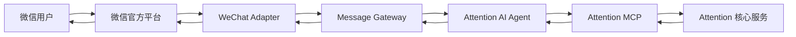

# Attention 微信 Adapter 历史交接（第一期已暂停）

账号、Free/Member、Channel 权益与绑定体验以 [`2026-08-04-attention-identity-membership-growth-design.md`](../superpowers/specs/2026-08-04-attention-identity-membership-growth-design.md) 为准。

更新时间：2026-08-07

当前产品决策：第一期只交付本地 Agent、Skill、MCP、OAuth 与 Local Channel Runtime 基础设施，不提供官方微信/Hosted Channel 产品入口。`apps/wechat-adapter` 与底层 Auth 合同作为历史原型保留，但 Web 旧 Channel API 统一返回 `410 Gone`，绑定页面已经移除，因此 Adapter 不能形成可用产品链路，也不应部署到生产。

历史实现包括 GET 服务器验证、POST 验签、安全 XML、兼容/明文/安全模式 AES、文本与链接卡片映射、进程内重试幂等、被动回复、可选客服消息和 access token 缓存。以下内容用于未来重新设计时参考，不代表当前可用能力。

## 1. 历史任务目标

实现 Attention 的官方微信 Channel Adapter。已绑定且具备 Member/Filter Channel 权益的用户在微信中发送文本、链接或公众号链接卡片后，获得与网页共用的 Attention Agent/MCP 业务结果；未绑定或 Free 用户进入绑定/升级路径，不直接执行私人任务。

微信 Adapter 是渠道接入层，不是内容解析器，也不是收藏服务。目标调用链为：



完整系统架构见 `docs/architecture.md`。身份、Channel、绑定和权益规则见 `docs/superpowers/specs/2026-08-04-attention-identity-membership-growth-design.md`；Content、Collection、去重与内容安全规则见 `docs/superpowers/specs/2026-07-31-attention-v1-design.md`。

## 2. 已确认的系统边界

### 微信 Adapter 负责

- 微信服务器配置、签名验证和回调协议。
- 将微信 `openid` 映射到 Attention 账号；可用时保留 `unionid`，但不能把微信昵称当作稳定身份。
- 将微信文本、链接和链接卡片规范化为统一消息。
- 基于微信消息 ID 做幂等，正确处理微信平台重试。
- 将消息发送给 Message Gateway。
- 将 Agent 的统一回复转换成微信支持的回复形式。
- 处理同步确认、异步完成通知、失败重试和渠道限流。
- 为未绑定账号返回安全的账号绑定入口。

### 微信 Adapter 不负责

- 判断用户意图。
- 从分享文本中提取或解析真实内容链接。
- 请求原始网页、还原短链或抓取正文。
- 生成摘要、标签或 Domain。
- 决定收藏公开或私密的业务规则。
- 直接创建 Content、Collection 或访问业务数据库。
- 直接实现 Attention MCP 工具。

这些能力分别属于 Attention Agent、受控 Web/Browser MCP 和 Attention MCP 核心服务。

## 3. 当前项目状态

- 已实现统一邮箱注册/登录、opaque Browser Session 和 Free/Member 实时权益；Channel 绑定页面已移除。
- 已实现 `channel_identities`、加密 `channel_pending_requests` 和一次性 `bind_intents`；subject ID 只以 keyed HMAC 保存，pending 原消息和处理结果使用 AES-GCM 保存。
- 历史 `POST /api/channels/messages`、`POST /api/channels/bind`、`GET /api/channels/pending/:id` 和账号 Channel 撤销接口现在统一返回 `410 Gone`，不认证、不写库，也不生成 `/channel/bind`。
- `/channel/bind` 页面已删除；`/account/connections` 只展示本地 Agent、OAuth 和 API Key 基础设施。
- 已实现网页 Agent、Hosted MCP、收藏 Service、隔离 Fetcher、URL 安全策略和确定性去重。当前 Agent 检索是可演示的确定性检索，不伪装成尚未接入的模型服务。
- 已实现微信官方服务器回调层的代码合同：官方签名/解密、安全 XML 映射、微信 access token 管理、被动回复和客服文字消息 provider。模板消息不在第一期范围内；真实平台验证仍需要认证公众号、官方凭据和实际接口权限。

历史内部接口不是面向微信公网暴露的回调地址。由于这些接口已禁用，当前也不应再把 Adapter 的 `/wechat/callback` 暴露为 Attention 第一期开口。

当前幂等缓存位于 Adapter 进程内；收藏路径还由核心服务的幂等键兜底。多副本或进程重启后的 Agent 查询若要求严格 exactly-once，需要后续把相同 `channel_message_id` 合同接到共享 Gateway 幂等存储，不能误称现阶段已具备跨实例 exactly-once。

当前代码中最重要的参考：

| 文件 | 用途 |
| --- | --- |
| `packages/contracts/src/input-envelope.ts` | 已有渠道、载荷和消息幂等字段约定 |
| `packages/contracts/src/collector-response.ts` | 当前收藏结果和错误状态 |
| `packages/collector/src/adapters/wechat-official-article.ts` | 公众号文章 URL 识别规则 |
| `apps/web/src/app/api/v1/collection-attempts/route.ts` | Web 渠道鉴权和错误响应参考 |
| `apps/web/src/server/collection-service.ts` | 当前收藏业务参考，不能复制进微信 Adapter |
| `packages/auth/src/sessions.ts` | 当前 Attention 账号 Principal 结构 |
| `packages/auth/src/channels.ts` | Channel subject HMAC、pending 加密、一次性绑定、解绑与回执 |
| `apps/web/src/app/api/channels/messages/route.ts` | 第一期间稳定返回 `410 Gone` 的历史入口 |
| `apps/web/src/app/channel/bind/page.tsx` | 已删除，不得重新生成指向它的链接 |
| `apps/web/src/app/api/channels/bind/route.ts` | 第一期间稳定返回 `410 Gone` 的历史入口 |
| `apps/fetcher/src` | 外部 URL 的安全访问边界 |

## 4. 建议的代码位置

建议新建独立应用：

```text
apps/wechat-adapter/
  src/
    config.ts
    callback-route.ts
    signature.ts
    xml.ts
    identity-binding.ts
    idempotency.ts
    message-mapper.ts
    reply-mapper.ts
    message-gateway-client.ts
    index.ts
  tests/
  package.json
  tsconfig.json
```

第一期可与其他服务部署在同一环境，但代码边界必须保持独立。不要将微信回调直接放进收藏 Service。

## 5. Message Gateway 合同

Message Gateway 是必要的逻辑层，但第一期不要求独立部署。微信 Adapter 面向以下合同编程；最终字段可在双方联调前以版本化 Schema 固化。

### 5.1 入站消息

```ts
type MessagePayload =
  | { type: "text"; text: string }
  | { type: "url"; url: string }
  | {
      type: "link_card";
      url: string;
      title?: string;
      description?: string;
    };

interface MessageEnvelopeV1 {
  schemaVersion: "1";
  messageId: string;
  channel: "wechat";
  channelMessageId: string;
  accountId: string;
  conversationId: string;
  payload: MessagePayload;
  receivedAt: string;
  replyToken: string;
}
```

约束：

- `accountId` 必须来自服务端绑定关系，不接受微信请求载荷直接指定。
- `replyToken` 是 Adapter 生成的短期 opaque 引用，Agent 不应看到 `openid`、AppSecret 或微信 access token。
- `messageId` 是 Attention 内部 ID；`channelMessageId` 用于识别微信重试。
- `receivedAt` 使用带时区的 ISO 8601。
- 原始 XML/JSON 不进入 Agent，也不长期保存。

### 5.2 Agent 回复

```ts
interface AgentReplyV1 {
  schemaVersion: "1";
  messageId: string;
  conversationId: string;
  replyToken: string;
  status: "completed" | "accepted" | "failed";
  text: string;
  actions?: Array<{
    label: string;
    url: string;
  }>;
}
```

Adapter 根据微信官方能力把 `text` 和 `actions` 转换为文字、菜单、客服消息或模板通知。不要把渠道专用消息格式放入 Agent 返回合同。

## 6. 微信身份绑定

建议唯一身份键：

```text
provider = wechat
wechat_app_id + openid -> attention_account_id
```

- 一个公众号内以 `app_id + openid` 唯一定位微信身份。
- 若官方条件允许，可保存 `unionid` 用于同主体产品间关联，但不能只依赖 `unionid`。
- `openid` 是 Channel Identity，不是 Attention 网站登录凭据；普通注册不主动要求绑定微信。
- 以下身份与绑定规则是未来重新启用 Adapter 时的历史设计；第一期所有账号都不能通过官方微信 Adapter 执行收藏或读取私人数据。
- 未绑定用户不执行收藏、搜索或读取私人数据。Adapter 创建短期 pending request 与一次性 `BindIntent`，然后返回绑定链接。
- `BindIntent` 创建时只绑定微信身份与 pending request，不能接受或预先写入目标 Attention 账号。
- 用户打开链接后复用统一邮箱验证码/密码登录；Free 用户先进入公开会员展示与开通流程，再看到目标展示名与可选 Attention ID 的明确确认页。
- 目标 `attention_account_id` 必须在确认时由当前已认证 Web Session 推导，不能来自 URL、微信载荷或客户端参数。
- 绑定 token 必须随机、单次使用、短期有效并只保存哈希；建议 pending request 保留约 10 分钟，绑定成功后自动继续原消息，过期后提示重新发送。
- 已绑定到其他账号时不得静默换绑；换绑必须走独立的解绑与重新确认流程。
- 解绑后立即停止该微信身份访问账号数据，但不删除 Attention 账号。

## 7. 回调、幂等与回复

### 回调处理顺序

1. 验证请求方法、Content-Type、时间戳、nonce 和微信签名。
2. 限制请求体大小，在解析前拒绝异常载荷。
3. 安全解析 XML/JSON，禁止外部实体和不受控递归。
4. 取得官方消息 ID；若该消息已处理，返回原确认结果。
5. 解析微信身份并查找 Attention 账号绑定与实时 Member 权益。
6. 若未绑定或不是 Member，创建/复用 pending request，返回绑定或升级入口，不向 Gateway 投递私人任务。
7. 若已绑定且为 Member，构造 `MessageEnvelopeV1` 并发送给 Message Gateway。
8. 在微信要求的时间窗口内确认回调；长任务转为异步处理。
9. Agent 完成后通过 `replyToken` 路由回复，不让 Agent 持有渠道凭据。

### 幂等键

优先使用微信官方消息 ID。若某种事件没有稳定消息 ID，使用下列字段的 HMAC 作为降级键：

```text
wechat_app_id + openid + event_type + create_time + normalized_payload_fingerprint
```

原始消息重试不得产生第二次 Agent 任务、第二条收藏关系或第二次 AI 检索计数。

## 8. 安全与隐私要求

- 只使用官方微信公众号或微信开放平台能力，不接非官方个人号机器人。
- 微信 AppSecret、回调 token、消息加密密钥和 access token 只从 Secret Manager/环境变量读取。
- 日志不得包含完整 `openid`、原始消息、链接中的凭证参数、access token 或绑定 token。
- 原始渠道载荷只允许在同步转换所需的短生命周期内存在，不进入失败队列、追踪系统或长期备份。
- 所有外部 URL 解析继续经过受控 Web/Browser MCP 和隔离 Fetcher；Adapter 不直接发起网页请求。
- 所有私人数据查询最终必须带由服务端解析出的 Attention 账号上下文。
- 回复中的 Web URL 使用 HTTPS，并避免暴露可枚举的内部 Content、Collection 或 Account ID。

## 9. 第一阶段交付物

1. `apps/wechat-adapter` 独立包和启动入口。
2. 微信服务器验证及消息回调端点。
3. 签名验证、解密/解析和安全载荷限制。
4. 文本、URL、公众号链接卡片到 `MessageEnvelopeV1` 的转换。
5. 微信身份绑定查询、BindIntent、pending request、未绑定/Free 回复和确认接口。
6. `MessageGatewayClient` 接口及 Fake 实现。
7. Agent 统一回复到微信格式的转换。
8. 消息幂等、同步确认和异步回复路径。
9. 配置项与 `.env.example` 说明，不提交任何真实凭据。
10. 单元测试、回调集成测试和本地模拟脚本。

## 10. 必须通过的验收场景

- 正确签名的微信文本消息生成一个 `MessageEnvelopeV1`。
- 错误、缺失或过期签名在进入业务代码前被拒绝。
- 普通 URL、整段分享文案和公众号链接卡片均保留必要信息交给 Agent，Adapter 自身不解析真实目标。
- 同一微信消息被平台重试多次，只向 Gateway 投递一次。
- 已绑定 Filter、已绑定 Member、已绑定 Free 和未绑定用户走不同身份路径；只有前两者进入 Agent 私人任务。
- 未绑定用户完成登录、开通 Member 和明确确认后，原 pending request 在有效期内自动继续且只执行一次。
- BindIntent 不能从 URL 或微信载荷指定目标 Attention 账号；冲突绑定不能静默覆盖。
- Agent 同步回复和异步回复都能回到原微信会话。
- Agent 或 Gateway 超时不会触发无限重试，也不会向用户伪造成功结果。
- 日志和错误响应中没有微信凭据、完整 `openid`、原始消息或敏感 URL 参数。
- Fake Gateway 可断言 Adapter 没有直接访问 Collector、数据库或外部内容平台。

## 11. 联调前需要产品方提供

- 微信官方账号类型、App ID 及已开通的官方能力清单。
- 回调域名、HTTPS 证书和部署环境。
- Secret Manager 中的微信配置，不通过 ZIP、聊天或 Git 传递。
- 统一登录页、公开会员展示页、账号绑定确认页、BindIntent 和 pending request 的正式接口。
- Message Gateway 的正式地址、认证方式和版本化 Schema。
- 同步回复、客服消息、模板通知或订阅消息中实际可用的能力选择。

## 12. 本地验证

仓库基线命令：

```bash
pnpm install
pnpm typecheck
pnpm test
pnpm lint
```

数据库集成测试会清空 `TEST_DATABASE_URL` 指向的数据库，不能使用开发或生产数据库。微信 Adapter 的协议测试应默认使用 Fake Gateway，且不依赖真实微信凭据。
