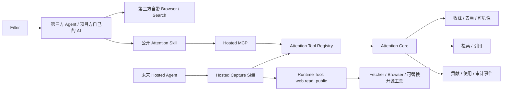

# Attention Core-first Agent 路线设计

状态：已确认

确认日期：2026-08-04

第一阶段范围现统一记录在 [`docs/first-release-scope.md`](../../first-release-scope.md)。本文只负责说明 Core-first 的 Agent 顺序；关于用户自己的 Agent、Desktop 和本地 iLink Runtime，以 [`2026-08-07-local-agent-channel-runtime-design.md`](./2026-08-07-local-agent-channel-runtime-design.md) 为准。

## 1. 目的

Attention 第一阶段先向 Filter、项目方自己的 AI 和用户自己的 Agent 开放可用、稳定的 Core/MCP/Skill，而不是先构建官方 Hosted Agent。真实 Agent 的调用行为、链接样本和失败记录用于完善 Core Tool Contract 与公开 Skill；官方 Hosted Agent 和企业微信客服在后续阶段基于这些数据建设。第一期同时交付 OAuth/API Key、公开接入文档和本地 iLink Runtime 基础设施，但不托管模型或消息渠道。

本设计调整开发顺序，不取消 Hosted Agent、企业微信客服或未来的公开网页读取能力。

## 2. 已确认决策

1. 第一阶段主线是 Attention Core、Hosted MCP、OAuth/API Key 和公开 Attention Skill。
2. 第一批使用者是受邀 Filter 和项目方自己的 AI。
3. 第三方 Agent 通常使用自身已有的 Browser、Computer Use、Web Search 或内容理解能力；Attention 第一阶段不向第三方 Agent 提供通用云端 Fetcher/Browser。
4. 第三方 Agent 与未来官方 Agent 最终都通过同一套 Attention Core 完成收藏、去重、权限、公开规则、检索和事件记录。
5. MCP 是 Core 的协议投影，Skill 是 Agent 的工作流说明；二者都不是业务真相或权限边界。
6. 官方 Hosted Agent 后续拥有 Runtime 级公开网页读取工具。该工具可由现有 Fetcher、Browser Worker、开源工具或自研实现承载，但不是第一阶段公共 MCP 的组成部分。
7. 未来官方 Agent 收到 Filter 的含链接消息时，默认解析并创建收藏；只有用户明确要求“不要收藏”时才只读取不保存。
8. 网页读取失败不能导致链接丢失。系统仍以原始 URL 创建收藏，并标记为部分处理或“暂时无法生成摘要”。
9. 官方 Agent 的网页工具实现选择后移：先积累真实链接与工作流数据，再以相同评测集比较开源方案、自研方案和混合方案。
10. Codex、Claude Code 的 Desktop 只支持交互式 Skill/MCP；微信入站由用户自己的本地 Agent / iLink 宿主负责，不把 Desktop 配置显示成 Hosted Channel 已连接。

## 3. 分层架构



### 3.1 Attention Core

Core 是唯一业务实现，负责：

- 账号、角色、权益与 scope；
- Content Identity、链接规范化和去重；
- Collection 创建、幂等、公开/私密状态和修改；
- Filter 公开资格、贡献与使用事件；
- 公开流和个人收藏的访问规则；
- 内容处理状态及必要派生信息；
- 检索结果与原文引用。

任何客户端都不能绕过 Core 直接写业务数据库。

### 3.2 Hosted MCP

Hosted MCP 将 Core Tool Contract 投影成 MCP 工具。它负责协议传输、OAuth/API Key Principal 解析和 MCP 结果编码，不复制业务逻辑。

同一 scope 下，不同 Agent 客户端必须获得相同领域语义。客户端差异不能改变去重、可见性、Filter 权限或贡献规则。

### 3.3 Public Skill

Public Skill 说明第三方 Agent 如何组合 MCP 工具，包括：

- 收到明确收藏请求时调用收藏工具；
- 处理多候选与一次性选择；
- 检查异步处理状态；
- 查询、找回并引用原文；
- 解释权限或会员错误；
- 使用 Agent 自己的浏览器理解网页，而不是要求 Attention 提供通用浏览器；
- 不把第三方 Agent 自行提取的正文当成 Attention 的可信采集证据。

Skill 不携带 Token，不授予 scope，也不能改变 Core 权限。

### 3.4 Future Hosted Agent

Hosted Agent 是 Attention Core 的正式 Agent Client。它使用与第三方 Agent相同的 Core Tool Contract，同时加载 Hosted Capture Skill 和 Runtime 网页工具。

Runtime 网页工具是受控 Agent Tool，而非面向第三方的通用公共接口。Agent 决定何时读取、何时升级到浏览器、何时停止或澄清；执行器继续强制 URL、网络、预算和无副作用边界。

## 4. 第一阶段交付范围

### 4.1 Core/MCP 工具语义

第一阶段至少应提供以下稳定用例：

| 用例 | 目标语义 |
|---|---|
| Collect | 接受 URL 或平台分享文本，执行候选识别、幂等、去重和收藏；Filter 可创建公开收藏 |
| Select candidate | 在多候选时使用一次性凭证完成选择 |
| Get status | 查询收藏和异步处理状态，不要求 Agent 通过反复列表猜测状态 |
| List collections | 分页读取当前账号的收藏，并返回原文链接 |
| Update collection | 修改公开/私密状态；所有权限和公开资格由 Core 重验 |
| Search | 检索当前账号可访问的个人与公开内容，返回可核验引用 |
| List public content | 按当前 Free/Member 权益读取公开流 |

工具命名可以沿用现有 `attention_*` 前缀，但输入、输出、错误、幂等和 scope 必须由统一 Tool Contract 定义。

### 4.2 统一工具注册

从现有 MCP Route 中提取 Canonical Attention Tool Registry。第一阶段的 MCP Adapter 使用该注册表；未来 Hosted Agent Adapter 将同一注册表转换为模型 Tool Schema。

Tool Context 至少包含：

- 可信 `account_id`；
- 实时 Member/Filter 权益；
- 已授权 scopes；
- 客户端与入口来源；
- request/run ID；
- 数据库和审计依赖。

模型输入不得提供或覆盖 `account_id`、角色、权益或 scope。

### 4.3 账号接入

- 支持浏览器 OAuth 的 Agent 优先使用 Authorization Code + PKCE。
- API Key 作为不支持浏览器 OAuth 时的备用方式。Key 只有一种，不携带产品等级；有效能力在每次调用时按账号实时权益计算。
- 网站 Cookie 不能冒充 Agent Credential。
- 每次工具调用重新检查当前权益；授权不冻结会员或 Filter 状态。
- 第一批 Filter 使用受邀账号连接 Hosted MCP。

Web 与 MCP 的能力等价、明确安全例外和防漂移验收以 [`docs/handoffs/mcp-web-capability-parity.md`](../../handoffs/mcp-web-capability-parity.md) 为准。新增适合 Agent 执行的 Web 业务能力时，必须同步登记并实现 MCP adapter，不能只更新网页入口。

### 4.4 第一阶段明确不做

- 官方 Hosted Agent Runtime；
- Hermes 或其他 Agent Runtime 的生产选型；
- Attention 托管的通用 Browser/Computer Use；
- 登录态网页访问、Cookie Vault 或有副作用的浏览器操作；
- 让第三方 Agent 直接控制 Attention Fetcher/Browser；
- 因第三方 Agent 提交正文而将其升级为服务端可信原文证据。
- Attention 托管的企业微信客服、公众号和其他 Hosted Channel 主入口。

## 5. Skill 迭代与数据闭环

### 5.1 应记录的数据

在符合既有隐私和不保存原文边界的前提下，记录：

- 公开链接及识别出的来源类型；
- 分享文本的结构类别，不为评测长期保存不必要的聊天原文；
- Agent 客户端、Core Tool 和 Skill 版本；
- 工具调用顺序、耗时、重试和稳定错误码；
- 候选数量、选择结果、重复命中和最终收藏状态；
- 用户对可见性、标题、标签或结果的后续修正；
- 解析失败、平台挑战、信息不足和链接失效信号；
- 用户是否明确选择“不收藏”。

不因建立评测集而长期保存第三方原始网页正文、Cookie、Authorization Header 或完整浏览器状态。

### 5.2 Skill 版本评估

每个工具调用和完整工作流关联 Skill ID/version。核心指标包括：

- 收藏成功率；
- 无需用户澄清的一次完成率；
- 多候选选择正确率；
- 重复收藏正确合并率；
- 用户修正率；
- 失败恢复率；
- 从请求到可用收藏结果的时间；
- 不应收藏时的误收藏率。

Skill 迭代不能用扩大权限来掩盖 Core 工具缺失。若工作流反复需要同一种稳定操作，应优先补齐 Core Tool Contract。

## 6. 后续 Hosted Agent 评测与建设

### 6.1 候选方案

后续使用同一链接与工作流评测集比较：

1. 开源 Agent Runtime + Attention Tool Registry；
2. 开源 Browser/Web 工具 + 自研轻量 Agent Loop；
3. 自研 Hosted Agent Runtime；
4. 开源 Runtime 与 Attention 专属 Skill/安全执行器的混合方案。

不因为某方案功能列表更多就直接采用。选型以真实任务成功率、隔离、安全、失败恢复、成本和可维护性为准。

### 6.2 Hosted Capture 默认工作流

```text
持久化渠道消息
→ 检测链接并激活 Hosted Capture Skill
→ Agent 调用 web.read_public
→ 信息足够时调用 Core Collect
→ 信息不足时决定 Browser、澄清或停止
→ 读取失败时仍用原始 URL 调用 Core Collect
→ 返回收藏与处理状态
```

含链接消息默认解析并收藏，包括“帮我看看这篇讲什么”等未明确说收藏的表达。只有用户明确说“不要收藏”“只看一下”或等价表达时，Agent 才只读取不创建收藏。

出现多个真实内容候选时必须澄清，不能因默认收藏规则擅自选择。

### 6.3 同等级或更好的含义

Hosted Agent 上线门槛是：在相同 Core、相同链接样本和相同任务上，达到或超过第一阶段主流第三方 Agent 的：

- 链接理解与收藏完成率；
- 多平台覆盖；
- 正确调用 Core 工具的能力；
- 失败解释和恢复体验；
- 数据隔离与网页安全边界；
- 延迟与单位任务成本。

## 7. 错误与降级原则

- Core 工具返回稳定机器错误码和人类可解释 guidance。
- 收藏请求已被 Core 接受后，后续 AI、Fetcher 或平台失败不能删除收藏关系。
- 第三方 Agent 没有浏览器时仍可收藏原始链接。
- Agent 不能通过公共流、匿名接口或其他账号数据绕过 scope。
- Skill 不得无限重试；重试次数与幂等键由 Core Contract 约束。
- 异步状态必须可查询，不能要求 Agent 依赖自然语言猜测是否完成。

## 8. 验收与测试原则

第一阶段验收包括：

1. 至少两种第三方 Agent 客户端通过 OAuth 连接同一 Hosted MCP。
2. 相同账号和输入在不同客户端得到相同收藏、去重、可见性和错误语义。
3. Filter 能通过 Public Skill 完成收藏、多候选选择、状态查询、找回和可见性修改。
4. Free、Member、Filter、scope 撤销和权益到期在每次调用时正确生效。
5. 工具调用记录包含客户端、Skill、Tool Contract 和结果版本，但不泄漏 Token 或不必要原文。
6. Public Skill 声明的工具与实际 MCP Tool Registry 保持一致。
7. 第三方 Agent 无法发现或调用未来 Hosted Runtime 的私有网页工具。

## 9. 与其他文档的关系

- 账号、会员、OAuth、API Key、Channel Identity 和增长权益继续以 `2026-08-04-attention-identity-membership-growth-design.md` 为准。
- 内容采集充分性、Fetcher、Browser 和 AI Content Processor 的详细设计继续由 `docs/content-acquisition-open-questions.md` 跟踪。
- `docs/architecture.md` 描述长期目标架构；本设计规定当前交付顺序，若二者在阶段范围上产生歧义，以本设计为准。
