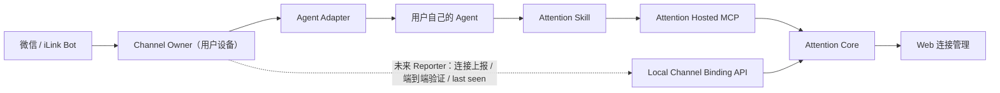

# Attention 本地 Agent 与微信 Channel 一期设计

状态：一期本地桥已交付；Codex 常驻 Runtime 与 Reporter 仍在集成/发布验收

最后校正：2026-08-10

本页服从 [`第一版范围`](../../first-release-scope.md)。这里的“支持微信 / iLink”指支持用户自己的 Agent 在本地承载渠道；不表示 Attention 提供 Hosted Agent、企业微信客服或公众号消息入口。

## 1. 目标

Attention 第一期不建设官方 Hosted Agent。用户继续使用自己的 Agent，Attention 提供统一的 Skill、Hosted MCP、账号授权与 Local Channel Runtime 基础设施，使支持 iLink 的本地 Agent 可以把微信消息交给自己的 Agent 处理。

一期必须覆盖：

- OpenClaw；
- Hermes Agent；
- Codex CLI（由 Attention 本地桥受限调用）；
- Claude Code（由 Attention 本地桥受限调用）；
- WorkBuddy；
- 后续遵循同一 Adapter Contract 的本地 Agent。

一期可验收结果是：五类 Agent 都能按其真实宿主能力加载或配置 Attention Skill/MCP，并完成账号授权与业务调用。OpenClaw、Hermes、WorkBuddy 使用宿主自己的微信能力；Codex 与 Claude Code 使用公开 Attention CLI 内的 `attention-channel` 本地桥。后者支持真实账号工具验收、一次扫码、用户级后台运行、持久化收发队列和同宿主多轮续接，但仍不能写成 Attention 托管或服务端可观测的 Channel。

第一期 Web 不展示“托管 Channel”或本地微信连接状态；只展示 Agent 配置入口、真实命令、文档链接和授权凭证。只有本地 Reporter/Adapter 实际发布并完成端到端验证后，后续版本才可以展示连接状态。

## 2. 非目标与关键边界

1. Local Channel Runtime 不是 Hosted Agent，不选择模型、不拥有 Attention 业务逻辑，也不替用户托管 Agent。
2. Skill 是工作流说明，不是常驻消息监听器；MCP 是业务工具协议，不是消息通道。
3. iLink token、同步游标、`context_token` 和媒体密钥只保存在用户设备，不上传 Attention。
4. 微信触发的 Codex/Claude 运行配置默认只开放 Attention MCP，不继承日常 Coding Agent 的 Shell、文件写入、浏览器或其他高权限工具。
5. iLink Bot 标识不是可信微信登录身份。不得将其用于 Attention 登录、找回账号、发放权益或全局唯一身份。
6. 同一个 iLink token 同时只能由一个 Channel Owner 轮询。切换 Agent 时先停止旧 Owner，再启用新 Owner。
7. WorkBuddy 使用其产品内建微信助理；除非官方后续公开协议，不假设或接管其底层 iLink 凭证。
8. “支持 Codex/Claude Desktop”一期只表示 Desktop 可交互使用同一套 Skill/MCP。本地桥调用各自 CLI 的 headless 模式，不承诺微信入站会显示成一个 Desktop 会话；Claude Code Channels 仍是另一条实验能力。

## 3. 统一概念

### 3.1 Channel Owner

持有消息通道凭证并持续接收消息的本地运行时。

| Agent | Channel Owner | 运行模式 |
|---|---|---|
| OpenClaw | OpenClaw Gateway + 腾讯微信插件 | native |
| Hermes | Hermes Gateway + Weixin Adapter | native |
| WorkBuddy | WorkBuddy 内建微信助理 | native |
| Codex | Attention CLI `attention-channel` | bridge |
| Claude Code | Attention CLI `attention-channel` | bridge |

### 3.2 Agent Adapter

把归一化后的 Channel 消息交给用户 Agent，并将最终回复交回 Channel Owner。Adapter 只能声明真实支持的能力，不能以 Skill 文案模拟宿主没有的后台能力。

### 3.3 Local Channel Binding

Attention 账号与一个本地 Channel 安装实例之间的关系：

```text
Attention Account
  ↕ installation OAuth client（仅已实现 Reporter 的 Runtime OAuth）
Local Installation
  ├─ ↔ WeChat / Native Channel（local-only channel credential）
  └─ → User Agent → Attention Skill → Hosted MCP（separate MCP OAuth）
```

它与现有公众号/企业微信 `channel_identities(app_id + openid)` 是两套模型。公众号身份可以由服务端直接处理；Local Channel 只有在本地 Reporter 实际交付后，才能通过端到端消息报告验证。WorkBuddy 当前没有受支持的状态/事件接口，不能建立 Attention 可验证的 Local Channel Binding。

## 4. 总体架构



### 4.1 Native 模式

OpenClaw、Hermes、WorkBuddy 继续使用各自 Channel Runtime。当前 Attention 安装流程只负责：

- 检测宿主与版本；
- 安装 Attention Skill；
- 配置 Attention Hosted MCP；
- 提供宿主官方微信连接文档和本地探针；
- 明确宿主状态不是 Attention 已验证状态。

OpenClaw 的微信能力来自腾讯外部 `@tencent-weixin/openclaw-weixin` 插件，不是 OpenClaw Core 或 Attention 内置能力。Hermes 的 Weixin 由原生 Gateway 管理。WorkBuddy 由产品 UI 管理，且没有可供 Attention 使用的连接状态、生命周期事件或身份导出接口。

### 4.2 Bridge 模式

Codex 与 Claude Code 的已交付方案是公开 Attention CLI 内的
`attention-channel` 本地桥：

```text
iLink long-poll
→ 消息去重与会话映射
→ 受限 Agent Profile
→ 受限 `codex exec` / `claude -p`
→ Attention Skill
→ Attention MCP
→ 回复 iLink
```

上述 `codex exec` 是当前已发布 CLI 产物的行为。已确认的下一个 Codex
Runtime 使用同一本地 Bridge 常驻管理 `codex app-server`：优先用本机保存的
thread ID 恢复，失败时回放本地最近 20 轮 user/assistant 对话重建会话。
它使用 `gpt-5.6-luna` / `medium` / `low` 的 Channel 默认值，独立
`CODEX_HOME` 中只加载 Attention MCP，并在初始化后验证 MCP 列表恰好只有
`attention`。该候选产物必须完成 Bridge 集成、产物同步和真机门槛后才能
写成已上线；协议结论见
[`Codex 常驻 Runtime 设计`](./2026-08-10-attention-codex-resident-runtime-design.md)。

用户首次在终端执行 `attention channel start <host> --background`：桥先通过宿主真实调用 `attention_get_my_account`，然后由用户扫码 iLink；凭据持久化后安装 macOS LaunchAgent、Linux systemd user unit 或 Windows 登录任务。它不是 root 服务，凭据不上报，登录过期时也不会在无人值守状态弹二维码。收发消息先落本地队列，进程中断后可继续；`channel logout` 同时撤销后台服务和本地 iLink 状态。

Claude Code `>= 2.1.80` 另有实验性的 MCP Channels：自定义 stdio Channel 只能向一个正在运行的 CLI 会话推送消息。它不是 Desktop 唤醒机制。稳定的常驻 Claude Agent SDK 方案需要用户自带 Anthropic API Key（或受支持云平台凭证），不能复用 claude.ai Pro/Max OAuth 或额度；这一方案也尚未交付。

### 4.3 Desktop 支持边界

- Codex Desktop 与 CLI 可交互使用 Attention Skill/MCP；本地 iLink bridge 只由用户设备运行。当前发布产物通过受限 `codex exec` 调用已安装 CLI，正在验收的候选产物改为常驻 `codex app-server`。两者都不承诺生成可见 Desktop 对话。
- Claude Code 的交互式 Skill/MCP 与 Desktop 入站是两回事。Claude Channels 只作用于正在运行的 CLI；Desktop 入站不支持。
- Desktop 不是 Channel Owner。iLink token 仍由 native host 或 `attention-channel` 持有，并且不得进入 Desktop、模型上下文或 Attention 服务端。
- Web 和安装器必须区分“Desktop 已配置”和“微信 Runtime 正在运行”，不能把前者显示成后者。

## 5. Adapter Contract

以下接口是未来可验证 Channel Adapter 的目标协议，不是五个宿主当前都已实现的声明：

```ts
interface AgentAdapter {
  readonly id: "openclaw" | "hermes" | "codex" | "claude-code" | "workbuddy";
  detect(): Promise<DetectionResult>;
  installSkill(input: SkillInstallInput): Promise<InstallResult>;
  configureMcp(input: McpConnectionInput): Promise<InstallResult>;
  configureRestrictedProfile(input: RestrictedProfileInput): Promise<InstallResult>;
  connectChannel(input: ChannelConnectInput): Promise<ChannelConnectResult>;
  status(): Promise<AdapterStatus>;
  disconnect(): Promise<DisconnectResult>;
}
```

只有实际交付 Reporter 的 Adapter 才能进入以下统一状态：

```text
not_installed
→ agent_ready
→ attention_authorized
→ channel_waiting_for_scan
→ channel_connected
→ verified
→ degraded / stale / disconnected
```

每个步骤必须是可重复执行的；重复运行安装器不得复制凭证、重复创建服务或破坏现有 Agent 配置。

## 6. 用户端到端流程

Web `/agent` 只给一个“复制给 AI”的提示词。Agent 阅读公开 `/doc`
对应宿主文档后：

1. 从公开 manifest 下载并校验 Attention CLI、Skill/Bundle，不依赖源码仓库。
2. 检测宿主与版本，按宿主真实机制安装 Skill，配置 Hosted MCP 并由用户完成 OAuth。
3. 必须真实调用 `attention_get_my_account`；本地配置或健康探针不是验收。
4. Native 宿主按各自官方微信文档操作。Codex / Claude Code 运行：

   ```bash
   attention channel start <codex|claude-code> --origin <Attention 地址> --background
   ```

5. 用户扫码并从微信发送真实链接；只有 MCP 成功且 Web“我的收藏”出现内容才算完成。
6. `attention doctor`、`channel status` 只报告可直接观测的本机脱敏事实。

本地 Reporter 完成发布后，才增加 Runtime OAuth、安装注册、配对挑战、心跳与断开流程。该流程必须使用和 MCP OAuth 分离的 client/audience/token。Reporter 只能上报设备/宿主类型、稳定状态、时间、错误码与队列数等脱敏断点；不得上报 iLink/Codex/MCP token、Codex thread ID、聊天或 message ID、URL、回复、联系人或原始微信标识。WorkBuddy 在没有官方状态接口前不进入这条流程，也不复用 MCP 制造“事件驱动心跳”。失败时从最后一个成功步骤继续，不要求整套重装。

无论 Reporter 是否发布，Bridge 都是唯一 iLink owner。Codex 掉线但 Bridge
仍在线时，Bridge 可在微信中返回本地状态、接收重试/继续指令并安全排队。
整台设备或 Bridge 离线时，微信不会有 Attention 回复；服务端最多只能
显示 Reporter 上次上报的最后心跳与最后断点，不接管 iLink 或模型。

## 7. Attention 服务端绑定模型

服务端只保存连接元数据：

- `account_id`；
- `installation_id`（本地生成的随机 UUID）；
- `agent_kind`；
- `channel_provider`；
- `channel_owner_kind`（native / bridge）；
- `device_name`（用户可修改的展示名）；
- `channel_account_fingerprint`（本地 HMAC/哈希，不是 token）；
- `paired_peer_fingerprint`（可选）；
- `adapter_version`、`skill_version`、`tool_contract_version`；
- `status`、`verified_at`、`last_seen_at`、`disconnected_at`、`revoked_at`；
- 无敏感内容的 capability 快照。

严禁保存：

- iLink `bot_token`；
- `context_token`；
- sync cursor；
- 微信联系人、聊天记录或原始媒体密钥；
- 用户公开微信号、手机号等未经官方 OAuth 验证的身份资料。

### 7.1 验证等级

- `reported`：本地运行时报告扫码成功；
- `verified`：本地运行时从微信实际收到一次性配对码并回传；
- `healthy`：近期真实消息或心跳成功；
- `stale`：超过健康窗口未上报；
- `disconnected`：本地主动断开；
- `revoked`：Attention 侧撤销绑定。

Web 上的“微信已连接”至少要求 `verified`。Attention 只能证明一次经过认证的本地安装完成了端到端消息验证，不能宣称腾讯对用户真实微信身份完成了官方认证。

## 8. Control Plane、MCP 与权限

Channel Runtime 的确定性生命周期不能依赖模型按时调用 MCP。它使用独立 OAuth resource：

```text
attention-channel-runtime
```

最小 scope：

- `runtime:register`：注册当前本地安装；
- `runtime:heartbeat`：上报 Runtime 与绑定健康；
- `channel:bind:report`：报告扫码、配对与端到端验证结果；
- `channel:disconnect:report`：报告本地断开和 token 删除结果。

确定性 Runtime API：

```text
POST   /api/runtime/installations
POST   /api/runtime/channel-bindings
POST   /api/runtime/channel-bindings/:id/verify
POST   /api/runtime/installations/:id/heartbeat
POST   /api/runtime/channel-bindings/:id/disconnect
DELETE /api/runtime/installations/:id
```

Runtime token 与 `attention-mcp` 业务 token audience 隔离，使用不同的 DCR client、refresh token 与本地安全存储，不能交叉使用，也不能用全权限 API Key 代替。心跳、stale 判定和本地断开确认只走 Runtime API，不由 Skill 或模型触发。

WorkBuddy 不获得 Runtime token、不发送心跳，也不通过 MCP 模拟配对事件。它只能使用正常的 Attention 业务 MCP；Attention 无法确认其微信绑定状态。

MCP 只承担用户意图驱动的 Attention 业务操作。Channel 生命周期不通过模型工具伪装；未来如需面向用户提供绑定管理工具，必须等 Reporter 已交付、权限和结构化错误稳定后再加入 Tool Registry。WorkBuddy 不存在 MCP Channel 事件特例。

所有接口都从认证 Principal 取得 `account_id`，请求不能覆盖账号、权益或 scope。请求和响应必须有稳定错误码、幂等语义、结构化输出和审计事件。Agent 日常业务工具仍遵循 Web/MCP 能力对等；Channel 连接不会增加超出账号权益的收藏、检索或公开能力。

## 9. 微信触发的受限 Agent Profile

当前 Codex/Claude Bridge 使用独立配置：

- 只加载 Attention Skill；
- 只连接 Attention MCP；
- 禁止 Shell、代码执行、文件写入与任意本地 MCP；
- 不自动继承日常会话历史或工作目录；
- 限制单条消息大小、并发、Agent turn 数和总超时；
- 对同一 `message_id` 幂等；
- 只允许已配对 peer 触发；
- 日志不记录 Token、完整私聊原文或原始链接以外的不必要内容。

Native Agent 无法由 Attention 强制沙箱时，安装器必须明确检查并提示其 Channel 权限；Skill 仍不得指示 Agent 使用与 Attention 无关的高权限工具处理微信请求。

## 10. 一期 Web 边界

第一期前端不展示 Hosted Channel，也不提前制作本地微信连接状态面板。连接与授权页只保留：

- Attention Skill 安装入口；
- Hosted MCP URL 与 OAuth 连接；
- 不支持浏览器 OAuth 时的 API Key；
- 已授权客户端与撤销操作。

Local Channel 的宿主配置与本地探针由 CLI/宿主 Agent 完成。服务端已提供结构化安装和绑定基础设施，但 Adapter 未交付时不生成或展示虚假状态。

### 10.1 后续 Web 连接管理设计

基础设施完成后，页面可先提供五宿主的真实配置链接、argv 命令、文档和 OAuth/API Key 管理。只有本地 Reporter 真实交付后，页面才承担“微信消息能否到达我的 Agent”的状态展示。

### 10.2 视觉与信息结构

沿用 Attention 现有视觉 Token：白色画布、近黑文本、人类珊瑚色与 AI 蓝色双信号。连接状态增加现有 success/warning/danger 色，不引入新的装饰性渐变。

页面签名元素是每个连接的一条真实路径：

```text
[Agent 配置] ── [Attention MCP]
[微信入口由本机/宿主管理]
```

一期路径只表达可证实的配置与授权，不把“OAuth 已授权”误显示成“微信已连接”。三段实时状态是 Reporter 交付后的后续设计。

设置页结构：

```text
连接与授权
├─ 我的 Agent
│  ├─ 已连接实例表格 / 移动端卡片
│  └─ 连接新的 Agent
├─ 微信连接
│  └─ Channel 路径、设备、运行端、验证、最后在线、诊断、断开
└─ 高级凭证
   ├─ OAuth 客户端
   └─ API Key
```

连接向导使用同一模态层逐步完成 Agent、Attention、微信三段配置；成功后关闭模态，外层立即出现表格记录。错误必须指出失败段和下一步，不显示笼统“连接失败”。

### 10.3 Web 操作边界

- 可以查看、重命名设备、查看诊断、撤销 Attention 授权；
- 可以请求远端断开，但只有本地 Runtime 在线并确认后才能删除本地 iLink token；
- Web 撤销后立即拒绝该安装继续上报或调用 Channel 管理能力；
- Web 不显示或下载任何本地 Channel token。

## 11. Manifest 与防漂移

机器可读 Agent Integration Manifest 是 CLI、Skill、Web 和测试的共同真相源。当前 schema `2.3.0` 将能力拆为六个独立轴，并为本地桥增加明确 engine 与真实工具验收：

```text
interactive
channel
runtime_reporting
inbound
desktop
claims
```

CI 必须验证：

- Manifest 中所有一期 Agent 都有真实的交互式安装说明；
- Skill 与 Web 显示的支持矩阵来自同一 Manifest；
- Skill 声明的工具名与 Tool Registry 一致；
- Native Agent 不被错误展示为由 Attention 托管；
- Codex/Claude 本地桥可用，但没有 Reporter 时仍不能在 Web 显示“微信已连接”；
- WorkBuddy 不得被赋予虚构的 MCP event、heartbeat 或 identity export；
- 命令以 `{ executable, args }` 表示，并以 `shell: false` 执行。

## 12. 验收标准

1. 五类 Agent 都有真实的 Skill/MCP 安装路径和清晰支持边界。
2. OpenClaw/Hermes 给出宿主真实 Channel 命令与本地探针，但不冒充 Attention 已验证状态。
3. WorkBuddy 只声明宿主管理且不可验证，不生成 Runtime token 或事件。
4. Codex/Claude Code 的 `attention_channel_bridge` 标记为 `available`，并通过公开 CLI 真正运行；独立 SDK Companion 仍为 `contract_only`。
5. Claude Channels 仍标记为另一条 `experimental` 能力；本地桥不承诺生成 Desktop 可见会话，稳定 SDK 替代方案明确需要 BYO API Key。
6. Attention Skill、OAuth、Hosted MCP 与账号实时权益在五种 Agent 上语义一致。
7. Runtime resource、scope、数据模型和端点通过协议测试，但在 Adapter 未交付时 `claims` 保持 false。
8. 服务端和日志中不存在 iLink token、`context_token` 或不必要聊天原文。
9. Web 只显示真实配置能力，不显示本地微信已连接状态。
10. Codex 与 Claude Code 分别通过 [`真机验收清单`](../../local-agent-wechat-device-acceptance.md)，包括后台重启、无损队列、真实分享格式、可见性、续接和退出。

## 13. 实施顺序

1. 已完成：schema `2.3.0` Manifest、防过度承诺测试、五宿主 Skill/MCP 安装器、doctor、公开文档和 Web 简化入口。
2. 已完成：Codex/Claude Code 本地桥、受限宿主调用、账号验收、持久化收发队列、用户级后台服务和本地退出。
3. 发布门槛：完成两宿主真机矩阵并保存脱敏证据。
4. 进行中：Codex 常驻 app-server、本地断点/恢复、Local Channel Binding、独立 Runtime OAuth 与第一个真实 Reporter；在这些能力完成发布和真机验收前，Web 不展示实时连接状态。
5. 后续：分别评估 SDK Companion；WorkBuddy 等待官方可验证接口，不制造私有协议。
6. Reporter 交付后执行 iLink 实机、launchd/systemd、权限与断线恢复 E2E；
7. 有可验证数据后再实现 Web 三段连接路径。
