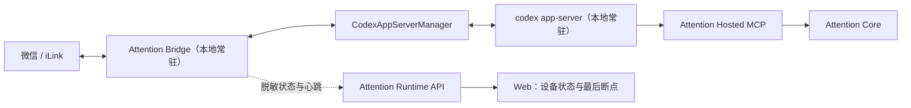
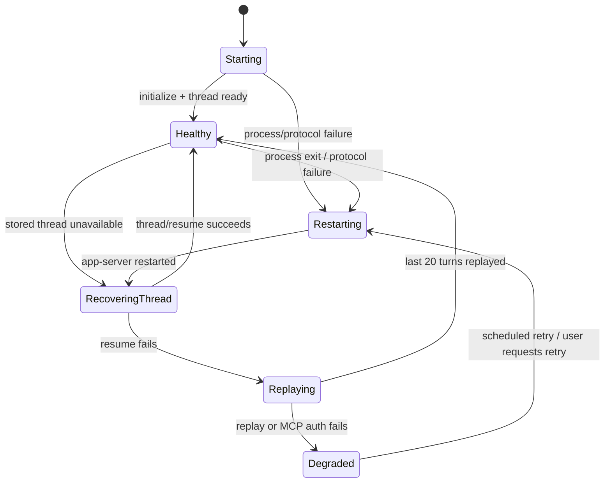

# Attention Codex 常驻 Runtime 与掉线恢复设计

状态：已确认；协议实机验证完成，Bridge/Reporter/Web 集成与发布验收仍在进行

确认日期：2026-08-10

本设计服从 [`第一版范围`](../../first-release-scope.md) 与
[`本地 Agent 与微信 Channel 一期设计`](2026-08-07-local-agent-channel-runtime-design.md)。
它只改变 Codex Bridge 的运行方式和可观测性，不把本地 Channel 变成
Attention Hosted Channel。

## 1. 背景与问题

当前 `attention channel start codex` 每处理一条微信消息都会启动一次
`codex exec`，随后等待子进程完全退出。真机观测中：

- 简单消息端到端耗时约 31–45 秒；
- 单次 Codex 调用的首个模型事件前存在约 15–25 秒启动与上下文准备时间；
- 模型完成后，子进程退出还会带来额外等待；
- 即使 thread ID 正确续接，下一条消息仍会重新启动 Codex 进程。

这不是模型生成速度的主要问题，而是运行时生命周期不匹配。微信 Channel
本身是常驻服务，Codex Adapter 也应使用常驻会话接口。

同时，当前 iLink 登录态、Codex thread ID、最近对话、待处理队列和断点全部
只存在本机。Attention 服务端已有 Runtime/Binding 数据结构和 API，但 CLI
Reporter 尚未接入，因此服务端当前不能可靠说明本地 Bridge 是否在线、Codex
停在哪一步，也不能在 Web 展示真实的最后状态。

## 2. 决策

采用以下组合方案：

1. Bridge 在本地常驻运行，并长期维护一个 `codex app-server` 子进程；
2. 每个已绑定的微信 owner 对应一个 Codex thread；一期单 owner，因此只有一个
   活跃 thread；
3. 优先使用持久化 thread ID 恢复；恢复失败时回放本地最近 20 轮对话建立新
   thread；
4. Codex 不可用时，Bridge 仍继续轮询 iLink、持久化消息并提供确定性状态回复；
5. CLI Reporter 使用独立 Runtime OAuth 向 Attention 上报脱敏心跳和断点；
6. 整台电脑或 Bridge 离线时，微信侧无法回复，Web 只显示最后心跳与最后断点。

不采用服务端托管兜底。Attention 服务端不持有 iLink 凭证，也不代替用户运行
Codex。

## 3. 总体架构



本地进程树：

```text
launchd / systemd / Task Scheduler
└─ attention channel start codex --service
   ├─ iLink long poll + durable inbound/outbound queue
   ├─ deterministic control commands
   ├─ Runtime Reporter
   └─ codex app-server --stdio
```

Bridge 是唯一 Channel Owner。`codex app-server` 只是本地 Agent Runtime，崩溃
不会导致 iLink token、消息队列或同步游标丢失。

## 4. Codex 常驻协议

Bridge 通过 `codex app-server --stdio` 启动子进程，使用 JSON-RPC 协议：

1. 启动后发送 `initialize`；
2. 有有效 thread ID 时发送 `thread/resume`；
3. 无有效 thread 时发送 `thread/start`；
4. 每条用户消息发送 `turn/start`；
5. 以 `turn/completed` 和最终 Agent message 为一次调用完成；
6. 超时先发送 `turn/interrupt`，再根据进程健康状态决定是否重启。

`app-server` 发起的反向请求必须由 Bridge 确定性处理：命令、文件与
审批请求一律拒绝，未知的 server request 返回 method-not-supported。
Attention MCP 是 `app-server` 在隔离配置中加载的唯一 MCP，不是 Bridge 临时
批准的 dynamic tool。不能把审批问题转发到微信让模型或用户临时扩大权限。

### 4.1 已实测的启动与隔离事实

2026-08-10 的真实 `codex app-server` 验证得到以下结论：

- 不使用已证伪的“忽略用户配置/规则”标志或 app-server 命令行沙箱标志。
- 通过命令行设置空 MCP 对象会与用户配置合并，不会清空已有 MCP，
  因此不能用于 Channel 权限隔离。
- Bridge 必须使用独立的 Channel `CODEX_HOME`；该目录只引用本机现有
  `auth.json`，并只配置 Attention MCP。Bridge 不解析、复制或上报 Codex
  认证内容。
- 可用的启动形式是在 `app-server --stdio` 之前传入全局 feature disable 与
  Attention MCP 地址；沙箱在 `thread/start` / `thread/resume` 中设为
  `read-only`，并在 `turn/start` 中设为无网络的 read-only policy，而不是
  app-server 命令行参数。
- `initialize` 后必须调用 `mcpServerStatus/list`，并严格验证结果中只有
  `attention`。多出或缺少任何 MCP 都进入 `degraded_runtime`，不处理用户 turn。
- 真实协议已验证 `thread/start`、`turn/start`、两轮复用与进程重启后
  `thread/resume`。`turn/start` 的文本输入需包含空的 `text_elements`。

这些是协议和安全边界的已验证事实，不表示 Bridge 集成、Reporter、Web
状态或新 CLI 产物已完成发布。

模型、推理档位、MCP 工具白名单和写操作授权保持当前产品默认：

- model：`gpt-5.6-luna`；
- reasoning effort：`medium`；
- verbosity：`low`；
- 仅加载 Attention MCP；
- 仅开放 Channel 所需的 Attention 工具；
- 不开放 Shell、文件写入、浏览器或用户其他 MCP。

这些是每位 Codex Channel 用户的默认值，不依赖开发者本机配置。

## 5. 并发与消息顺序

一期每个 Bridge 同时只执行一个 Codex turn：

- iLink 收到的消息先持久化到 `pendingInbound`；
- 同一 owner 严格按接收顺序处理；
- Codex 忙碌时后续消息留在队列，不并发写入同一 thread；
- 进程重启不清空 inbound/outbound 队列；
- 同一微信消息使用完整 message ID 的稳定哈希生成幂等键，不能再对长 ID 直接
  截断，以免相同前缀碰撞。

模型回复先进入 `pendingOutbound`，成功发送微信后才标记完成。这样进程在模型
完成后、微信回执前崩溃也不会丢回复。

## 6. 恢复状态机



恢复规则：

1. 子进程异常退出后使用有上限的指数退避重启；
2. 重启成功后优先恢复本地保存的 thread ID；
3. `thread/resume` 明确失败时才创建新 thread；
4. 新 thread 注入固定 Bridge 指令，并回放本地最近 20 轮对话；
5. 回放成功后原子替换 thread ID，继续队首消息；
6. 回放失败进入 `degraded`，消息继续排队，不伪装成功；
7. OAuth/MCP 权限错误属于需要用户处理的故障，不无限快速重启 Codex。

Bridge 收到 SIGTERM/SIGINT 时先停止接收新 turn，保存状态，尽量中断当前 turn，
再关闭 app-server。被强制终止时依赖已持久化队列恢复。

## 7. 本地确定性对话

以下控制意图由 Bridge 在调用模型前识别，Codex 离线时也能工作：

- `状态` / `连接状态`；
- `帮助`；
- `重试` / `重新连接`；
- `继续`；
- `重置会话`（需要明确确认，不能误触）；

控制命令只对去除首尾空白后的整条消息做精确匹配，同时支持对应的 `/status`、
`/help`、`/retry` 等显式形式。不得因为普通对话中包含“继续”“状态”等词就拦截
用户消息。`继续` 只在 Bridge 正处于可恢复的暂停/降级状态时作为控制命令；健康
状态下仍交给 Codex。

状态回复至少包含：

- 微信连接是否正常；
- Attention MCP 账号最近一次验收是否成功；
- Codex Runtime 状态：启动中、在线、重启中、降级或需重新授权；
- 最近成功处理时间；
- 当前断点阶段；
- 待处理与待发送数量；
- 下一步恢复动作或用户需要执行的操作。

示例：

> 微信连接正常，Attention 已授权。Codex 当前离线，最后成功处理于 18:07，
> 2 条消息等待处理。正在自动重启；恢复后会从断点继续。

普通聊天不再发送“收到，正在处理”。只有识别为收藏链接的消息可以立即发送
简短的“正在收藏”，最终仍必须给出成功或失败结果。

## 8. 本地断点模型

在现有 `~/.attention/channel/state.json` 基础上增加非敏感运行状态：

```text
runtimeState
├─ phase
├─ lastTransitionAt
├─ lastHealthyAt
├─ lastSuccessfulMessageAt
├─ lastErrorCode
├─ retryAttempt
├─ nextRetryAt
└─ activeTurnMessageRef
```

`phase` 使用稳定枚举，例如：

```text
starting
healthy
restarting
recovering_thread
replaying_history
degraded_auth
degraded_runtime
stopped
```

状态文件继续使用目录 `0700`、文件 `0600` 和原子替换写入。thread ID、最近 20
轮原文、iLink token、context token、同步游标和原始微信身份只保存在本机。

## 9. 服务端 Reporter

Reporter 是 Bridge 内的确定性组件，不由模型或 Skill 调用。它使用和业务 MCP
OAuth 分离的 `attention-channel-runtime` resource 与最小 scope：

- `runtime:register`；
- `runtime:heartbeat`；
- `channel:bind:report`；
- `channel:disconnect:report`。

Runtime OAuth 在交互式 `attention configure` / `channel start --background` 安装
阶段完成，并将 refresh token 保存到本地受限凭证存储。已经进入 launchd、systemd
或 Task Scheduler 的无交互后台服务不得自行打开浏览器。未完成 Runtime OAuth 时
本地 Bridge 仍可工作，但 CLI 和 Web 必须明确显示“本地可用，云端状态未连接”，
不能把缺少 Reporter 误报成微信未绑定。

服务端可以保存：

- account ID 与随机 installation ID；
- Agent/Bridge 类型、设备展示名与版本；
- Channel provider 和不可逆账号 fingerprint；
- Bridge、iLink、Codex 三段脱敏状态；
- 最近心跳、最近健康、最近成功处理时间；
- 稳定断点阶段、稳定错误码和队列数量；
- capability/version 快照。

服务端严禁保存：

- iLink bot token、context token、sync cursor；
- Codex thread ID、Codex OAuth token；
- 微信消息、对话历史、原始链接或回复内容；
- 微信联系人、公开微信号、手机号等身份资料。

心跳建议每 60 秒发送一次；状态发生关键变化时立即上报。连续三个心跳窗口未
更新后，Web 将实例显示为 `stale`；显式退出或撤销则显示 `disconnected` 或
`revoked`。服务端状态只表示“最后一次可观测事实”，不能宣称当前必然在线。

## 10. Web 与离线边界

Web 的连接状态只显示 Reporter 能证明的信息：

- 设备和 Agent；
- 微信绑定验证等级；
- Bridge/Codex 最近状态；
- 最后在线时间；
- 最后断点和建议动作；
- Attention 授权撤销入口。

当 Codex 掉线而 Bridge 在线时，用户可以继续通过微信查询状态、触发重试，业务
消息安全排队。

当整台电脑、网络或 Bridge 离线时：

- 微信无法收到 Attention 回复；
- Attention 服务端不会接管 iLink；
- Web 根据最后心跳显示“设备离线 + 最后断点”；
- 设备恢复后 Bridge 从本地队列和断点继续。

这是一期明确接受的产品边界。

## 11. 错误分类

对外只暴露稳定错误类别，不泄露命令、路径、token 或模型内部错误：

| 类别 | 行为 |
|---|---|
| `codex_not_installed` | 停止自动重试，提示安装或修复 PATH |
| `codex_auth_required` | 保持 Bridge/iLink 在线，提示完成 Codex 登录 |
| `attention_auth_required` | 保持队列，提示重新授权 Attention MCP |
| `codex_runtime_crashed` | 自动重启并优先恢复 thread |
| `thread_resume_failed` | 新建 thread，回放最近 20 轮 |
| `turn_timed_out` | 中断 turn，按策略重试一次后进入降级 |
| `ilink_disconnected` | 停止模型消费，保留队列并重新登录/轮询 |
| `runtime_report_failed` | 不影响本地收发；本地记录并稍后补报 |

Reporter 故障不能阻断本地收藏；Codex 故障不能阻断 iLink 轮询；iLink 故障时不能
继续消费并生成无法送达的普通回复。

## 12. 兼容与迁移

- 现有 `brainSession.sessionId` 直接作为首次 `thread/resume` 输入；
- 现有最近对话和收发队列继续复用；
- 旧版本状态文件缺少 Runtime 字段时使用安全默认值；
- 常驻协议不可用的旧 Codex 版本必须由 `doctor` 明确报告，不静默退回每消息启动；
- CLI 必须固定并验证所支持的 app-server 协议版本；初始化握手或必要字段不兼容时
  进入 `degraded_runtime`，不能猜测协议继续运行；
- Claude Code 暂时保留现有 subprocess Adapter，本设计不虚构其常驻协议；
- Native OpenClaw/Hermes/WorkBuddy 不经过 Codex Bridge，不受影响。

## 13. 验收标准

1. 同一 Bridge 生命周期内只启动一个 `codex app-server`，每条消息不再创建新的
   `codex exec` 进程。
2. 连续两轮微信对话使用同一 thread，回复与输入严格对应。
3. 正常简单对话不再承担进程冷启动与退出等待；分别记录排队、Runtime、模型和
   微信发送耗时。
4. 杀死 app-server 后 Bridge 仍在线、消息不丢，并自动恢复相同 thread。
5. 伪造/失效 thread ID 后自动回放最近 20 轮建立新 thread。
6. Codex 离线时发送“状态”能立即得到确定性回复，不调用模型。
7. Codex 离线期间的普通消息持久化排队，恢复后按顺序处理且不重复。
8. 重启电脑或 Bridge 后队列、iLink 登录态和断点可恢复。
9. Runtime Reporter 上报的服务端记录不含 token、thread ID、聊天、链接或回复。
10. Bridge 整体离线时 Web 在心跳窗口后显示 stale 和最后断点，不错误显示在线。
11. MCP 写工具白名单、账号权益和当前 Web/MCP 能力对等规则不因常驻化扩大。
12. macOS launchd、Linux systemd user service 与 Windows Task Scheduler 均通过
    重启、崩溃恢复和退出验收。

## 14. 实施边界

本轮实施包括：

- Codex app-server Client/Manager；
- Bridge 生命周期集成与单 turn 串行队列；
- thread 恢复、20 轮回放与状态机；
- 确定性状态/重试命令；
- CLI Reporter、Runtime OAuth 与心跳；
- Web 最后状态的只读展示；
- 日志分段耗时与脱敏诊断；
- 单元、协议、进程故障和真机 E2E。

本轮不包括：

- Hosted Agent 或 Hosted Channel；
- 服务端保存/代理 iLink 凭证；
- 电脑离线后的微信云端回复；
- 多微信 owner 并行、多 Codex thread 调度；
- Claude Code 常驻协议重构；
- 向 Codex 开放 Shell、浏览器、文件写入或额外 MCP。
