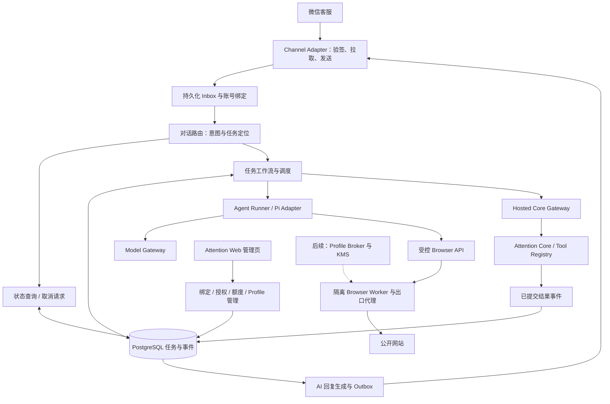

# Attention Hosted Agent 完整方案设计

日期：2026-09-05

版本：设计稿 1.0

状态：供产品与工程评审；不代表已经实现、授权采购或可以直接部署

## 0. 方案结论与阅读方式

Attention Hosted Agent 是由 Attention 托管的收藏整理助手。用户在微信发送链接，云端保存收藏、读取内容、生成摘要，并在原会话里回答进度、执行重试或取消。用户电脑关闭时任务仍可执行；模型、浏览器或消息渠道短暂故障后，系统能够从持久化任务恢复。

推荐采用 **独立任务控制面 + 可替换 Agent Loop + 隔离网页执行器 + 现有 Attention Core**。首个内部版本以匿名公开网页为范围，使用 Pi Agent Core 作为优先验证的执行器，PostgreSQL 保存工作流。用户登录态浏览器有完整设计，但作为后续独立交付阶段；不得提前接入共享摘要。

本文作为 Hosted 下一阶段的主设计，整合 [8 月渠道与隔离草案](./2026-08-25-cloud-agent-executable-readiness-design.md) 和 [Bridge / Hosted 共同任务对话合同](./2026-09-05-attention-agent-task-conversation-design.md)。旧稿用于保留 G0 测试清单和历史依据；两者冲突时，本稿对 Hosted 的明确决定优先。Bridge 的体验目标沿用共同合同，本文不把云端依赖或浏览器权限强加给本地 Bridge。

这是多子系统的总体设计，实施时按第 18 节拆分计划。当前 [第一版范围](../../first-release-scope.md) 继续有效，正式开放 Hosted 时再更新产品承诺。

| 分类 | 决定 |
| --- | --- |
| 用户已确认 | Bridge / Hosted 均需自然回复、任务追问、自动重试、结果通知和恢复能力 |
| 沿用既有方向 | 微信客服一对一入口；绑定 Attention 账号；Web 做管理，不做聊天；同账号任务串行 |
| 本稿推荐默认 | 小规模白名单试点、私密新收藏、匿名网页先行、PostgreSQL 工作流、Pi 可替换适配器 |
| 进入真实试点前需落实 | 企业微信测试资产、模型 API 与数据地域、费用上限、隔离计算资源、密钥管理和运维负责人 |

后面出现的并发、预算、时间和容量均为**设计起始值或验收目标**，不是已测性能、供应商报价或 SLA。

## 1. 用户体验与首发范围

### 1.1 基本流程

1. 在 `/agent/hosted` 登录 Attention，阅读托管范围并开启云端助手。
2. 打开专属微信客服会话，完成与 Attention 账号的双向绑定。
3. 发一条公开网页或公众号文章链接；系统先建立任务和收藏，再尝试整理。
4. 可以说“在做了吗”“刚才那篇再试一下”“取消这条”。无须重复发链接才能恢复。
5. 成功时收到结果通知；暂时失败时知道是否已经安排重试、何时再试；不能恢复时得到具体下一步。
6. Web 可查看连接、待处理任务、额度及需要处理的问题；不出现第二套聊天会话。

示例仅说明事实和交互，不作为固定模板：首次读取失败时，AI 可以说“链接已保存，这次没读到正文，已安排约两分钟后再试”；若任务根本未入队，则必须说明没有安排成功。查询时区分“还在排队”“正在读取”“等待重新登录”“本轮已暂停”。

### 1.2 范围分层

| 能力 | 首个匿名内测 | 后续独立阶段 |
| --- | --- | --- |
| 普通公开网页、公众号公开文章 | 支持并记录真实读取失败；不保证所有站点可访问 | 根据样本扩大站点覆盖 |
| 一次一条链接、Core 多候选澄清 | 支持；多个独立链接请拆开发送，单链接解析歧义用候选选择 | 批量任务另行设计 |
| 收藏、摘要、标签 | 沿用 Core；新收藏默认 private，重复收藏保持原可见性 | Filter 默认公开须明确产品决定 |
| 任务状态、重试、取消、简短追问 | 必须支持 | 更丰富的查找与整理工具按授权扩展 |
| 网页需要登录 | 保留收藏，报告需要登录或暂不支持 | 共享 Profile / 用户独享 Profile 分阶段验证 |
| 正文原文、截图、完整聊天档案 | 不长期保存，不在微信结果回执中回显 | 需要单独产品与隐私合同 |
| Web 聊天、群聊、语音/图片任务、开放式研究 | 不进入本期 | 不阻塞本方案完成 |

普通短对话可以回应，不因此创建网页任务。用户明确说“只问进度”不触发补全；明确说“不要收藏”不创建收藏，首期仅解释当前专用收藏渠道能力，不偷偷保存。

新收藏的 private 默认需要作为 Hosted 入口的显式 Core 策略实现并测试，不能假设复用现有按权益推导的默认行为就能满足它；不得借此改变 Web、MCP 或 Bridge 的现行可见性规则。该推荐默认在正式开放前需用户确认。

### 1.3 权益与费用

建议首批仅开放给 allowlist 中有 Member 或 Filter 权益的账号。Hosted 消耗独立计算额度；Member 当前的收藏权益不等于无限模型调用。已有新账号默认 Member 的规则不变，Hosted 开关和额度独立校验。

开启时展示：云端将接收哪些消息、网页内容会发往哪个模型服务、任务保留期限、额度和停用方式。未绑定、关闭、权益不足或额度不足时不静默排入收费任务；已创建的收藏和已完成结果仍可在原账户查看。

## 2. 方案取舍

| 方案 | 适合之处 | 本项目取舍 |
| --- | --- | --- |
| 自有任务调度 + Pi Adapter + 独立 Browser | 保留 Core，模型和执行器可替换，能精确定义恢复与成本 | 推荐；首期用 PostgreSQL，按需扩容 |
| 把本地 Codex / Bridge 整套搬到服务器 | 初期演示快，已有对话路径较多 | 不作为 Hosted 基线；多账号授权、租约与密钥边界仍需重新建设 |
| 托管 Workflow / Browser 服务 | 可以减少部分运维开发 | 容量增长时评估；页面和凭据流向、费用及迁出能力须重新验收 |

逻辑上分离模块，不要求第一天部署十几个微服务。可信控制服务可共用代码镜像、以不同进程和角色运行；浏览器必须与数据库、密钥服务、模型网关分开。

## 3. 总体架构

对话路由与任务执行有独立并发预算。网页读取期间，用户的状态查询和取消请求可以直接读写任务状态；不会在同一条长模型 turn 后等待。业务副作用仍受账号串行和任务执行权约束。

## 4. 现有代码复用与必须新增的能力

基线为本地 `main` 的 `6ea30ec`。以下是仓库审阅结果，不是假设已经存在的 Hosted 接口。

| 当前实现 | 复用方式 / 缺口 |
| --- | --- |
| `apps/web/src/server/attention-tool-registry.ts` | 当前合同 1.6.0、15 个业务工具；Hosted 使用最小子集，不能直接开放全部工具 |
| `collection-service.ts` / `collection-status-service.ts` | 复用收藏、归属、重复合并、候选选择和实时权益规则 |
| `content-enrichment-service.ts` | 复用公开内容摘要提交；最长 2000 字符、1–8 个标签、已经补全时复用结果 |
| `attention-tool-audit.ts` | 已有 hosted_agent 来源枚举，但 credentialKind 只有 oauth/pat；Hosted 委托身份与审计必须新增，不能伪造 OAuth |
| `packages/ai` | 目前为结构化 JSON 单次调用；不能当成已实现工具循环、流式事件或预算网关 |
| `apps/worker/src/job-repository.ts` | 参考 claim token、lease、SKIP LOCKED；Agent 工作流独立建表，不塞入原内容 jobs |
| `apps/fetcher` / `packages/collector` | 复用 URL 检查、规范化和轻量元数据；不等于隔离的交互浏览器 |
| `content.summary.ready.v1` 与 Runtime 通知 | 复用结果事件语义；当前通知与本地绑定及 wechat 收藏有关，Hosted 需独立投递目标 |
| `packages/db` / Drizzle migration guard | 遵循现有 PostgreSQL 17 与迁移模式；新 role、RLS、事务事件一并测试 |
| 旧 `apps/wechat-adapter`、停用的 channels 路由 | 属公众号历史能力；新增 wxkf 适配器和专用路由，不恢复错误协议 |
| `/agent` 云端“开发中”卡片 | 内测开关打开且服务验收通过后才启用真实入口 |

## 5. Channel：微信客服与可靠消息

### 5.1 已核验的平台约束

2026-09-05 通过直接读取官方文档核验：

- 发送仅适用于可由 API 接待的会话；客户上行后的回复窗口为 48 小时、最多 5 条，继续上行可再次回复；文本限制 2048 字节，客户端 msgid 要在客服账号内唯一且不超过 32 字节。发送 API 成功不等于最终送达。[发送消息](https://developer.work.weixin.qq.com/document/path/94677)
- `sync_msg` 按客服账号与 cursor 拉取最近 3 天消息；回调 token 有效 10 分钟，无 token 时限频更严；`has_more=1` 即使列表为空也需继续。客户、系统事件和人工消息须分别处理。[接收消息和事件](https://developer.work.weixin.qq.com/document/path/94670)
- 会话状态 0/1 可用于自动回复，人工接待和已结束状态需按平台状态机处理。[分配客服会话](https://developer.work.weixin.qq.com/document/path/94669)

这些是文档合同，不证明本企业已获权限，也不能证明超时后重复发送的幂等行为。真实消息顺序、额度刷新、重复 msgid 和失败事件必须经过 G0 真机验证。

### 5.2 入站路径

回调端点只做签名/解密校验、保存 wakeup 和快速应答，不等待模型。每个 `(corp, open_kfid)` 使用一个 pull lease。puller 读取 cursor、拉取消息，把新增消息和下一 cursor 在同一事务提交；重复回调与崩溃重放用 provider msgid 去重。

仅客户 text/link 可创建或控制任务。系统发送失败、撤回、会话变更等事件走控制分支；人工消息不当成用户授权。遇到未知协议字段保留稳定错误与可诊断状态，不能静默当成正常对话。

未绑定消息只生成一次性绑定入口，不保存待执行链接，绑定后明确提示重新发送。回调丢失由有界的 cursor reconciliation 补偿，不能只依赖 webhook。

### 5.3 Outbox 与发送额度

发送额度按 **客服账号 + 用户会话** 统一记账，所有任务、查询回复、绑定提醒和通知共享额度。不能给每个任务各自假定 5 条。按已去重的有效上行事件刷新预算，刷新细节以 G0 为准。

每个任务的一个恢复周期最多主动发一次受理说明和一次结果变化通知；短时间直接完成时合并为一条。等待自动重试时不逐次推送。若本周期已通知需要用户操作，后续恢复结果合并到下一次有效上行的回复或新周期通知，不无条件增加主动消息。用户主动查询的回复另按会话预算计算。额度紧张时保留最终结果；过窗进入 `deferred_window`，等下一次上行后合并说明。未经用户选择不改用邮件或其他目的地。

Outbox 状态使用 `pending → sending → accepted / rejected / unknown`，另有 `deferred_window` 和后续 `provider_failed`。`accepted` 不称“已送达”；超时导致结果未知时先关联失败事件及 G0 验证过的规则，不能盲目再次发送。provider msgid 从持久化通知 ID 派生，重试复用，数据库检查唯一性。

长回复在生成端压缩到单条安全长度，按 UTF-8 字节检查，预留平台余量；不通过拆成多条消耗掉结果预算。发送前重新检查会话归属和任务当前状态，丢弃过时的“仍在处理”通知。

## 6. 账号绑定、授权与撤销

### 6.1 绑定流程

1. 客服会话发起绑定，服务端生成随机、短期、单次 bind intent；持久化 token 哈希，不在日志保存完整链接。
2. 用户打开同域 Web 页面，用现有登录模态窗完成登录，查看授权内容；GET 请求不产生绑定。
3. 确认后在原微信会话完成一次短期 challenge，证明 Web 登录者控制该渠道身份，防止绑定链接被转发后绑定错人。
4. 服务端事务完成 binding 与 Hosted grant，并消费 intent/challenge；nonce、CSRF、期限和账号冲突必须校验。
5. 成功后再接收新任务。邀请码、邮箱、昵称或模型输出均不能直接指定 acting account。

建议 bind intent 10 分钟、challenge 5 分钟有效；重复确认只返回已有结果，不生成第二份绑定。渠道主体使用带版本的 HMAC(corp + open_kfid + external_userid) 作索引，原始发送身份在渠道域加密保存。

### 6.2 Hosted grant 与 Core Gateway

用户开启 Hosted 产生独立 `hosted_grant`，记录账号、允许能力、产品规则版本、限额、授权/撤销时间和 epoch。它不是用户现有 MCP OAuth 或本地 Runtime OAuth 的替代品。

可信调度器领取任务后签发短期执行 capability，绑定 task、attempt、grant epoch、lease generation、允许操作和 audience；建议有效期 2 分钟、续期时重新核验。capability 只在可信工具代理中使用，模型输入中没有 bearer、account_id 或可修改的身份参数。

Core Gateway 以服务身份验证调用者，再从任务和 grant 取得账号上下文，检查最新权益及操作白名单。新身份在审计中记为 `hosted_delegate`，不是伪装成现有 `oauth/pat`。Gateway 与现有服务同属 Core 边界，通过私有入口调用同一业务函数；外部代理不路由该入口，应用本身仍验证身份。

RLS 是附加隔离层；可设置账号变量的服务必须先验身份，不能把任意 `account_id` 包装成安全授权。数据库服务角色不使用 owner、superuser 或 BYPASSRLS；跨账号调度只通过限制字段的领取函数。相关 owner 绕过风险依据 [PostgreSQL RLS 文档](https://www.postgresql.org/docs/17/ddl-rowsecurity.html)。

### 6.3 停用、解绑与取消

停用 Hosted 立即阻止新任务，并请求停止未完成任务；解绑同时撤销 grant、提升 epoch、禁用 Profile 使用和原渠道投递。已完成收藏继续属于用户。聊天“解绑”引导 Web 明确确认；任务“取消”无需额外账户解绑操作。

每次持久化副作用都核验最新 epoch/fence。取消与提交竞争时以数据库事务先后顺序为准：提交已完成则说明“收藏已保存，后续整理已停止”，不能声称已撤回保存。

## 7. 对话、记忆与真实回复

### 7.1 意图与任务定位

对话路由输出严格的结构化意图：`create / status / retry / cancel / clarify / help / small_talk`。明确的轻量命令可本地解析，其余使用低成本结构化模型调用。模型只提出意图和当前会话允许的任务引用，服务端校验后执行。

定位顺序为：明确引用原消息或任务序号 → 最近明确的任务焦点 → 唯一相关任务。仍有多个可能目标则澄清。不用“最新一条未完成任务”覆盖明确的原消息引用，也不根据摘要文字猜内部 ID。

“重试”优先作用于明确任务；被依赖阻塞时先恢复依赖。查询只读状态；取消登记请求；人工重试创建原任务的一次新尝试。相同消息重放复用 operation key，用户新发的重试消息有新的 operation key，但收藏副作用仍复用原 task key。

### 7.2 最小记忆

任务真相由数据库保存。会话仅保存已绑定账号、焦点任务、最近任务别名、待确认意图及少量必要上下文。建议活动焦点 7 天、每会话最多 20 个近期任务引用；过期后可从账号任务列表重新定位。

正常模式不持久化完整 Pi 消息链、思维过程、DOM 或网页截图。对话恢复依赖任务摘要快照，不能依靠某个常驻模型实例始终在线。清空聊天焦点不会隐式删除收藏或取消后台任务。

### 7.3 回复生成

执行器先提交事实，再生成 `ReplyFacts`：目标别名、收藏是否已保存、当前执行阶段、失败类别、已安排的时间、允许操作、通知原因和 task revision。Reply Composer 只拿这些事实，用 AI 组织简短中文。

正常回复不强制固定句式。调度入库成功才可说“已安排”，执行权有效且已开始才可说“正在做”，Core 已确认才可说“完成”。发送前检查 revision；过时则重新取事实。安全检查、受限事实集合和回归评测共同约束表达，**不宣称正则或另一模型能证明任意文本完全真实**；无依据的完成/重试承诺必须被验收用例拦住。

模型不可用、输出为空、与事实冲突或包含敏感内容时，使用最小事实兜底并发送。不能为了生成一句漂亮文案而丢失最终通知。沿用现有渠道对正文、完整标题、摘要内容、标签和内部标识的回显边界；本期回复是结果和进度说明。

## 8. 任务状态机与调度

业务工作状态与 `collection_saved`、`summary_ready`、通知状态分别存储。`pending` 不是正在运行的证据。

| 状态 | 含义 | 出口 |
| --- | --- | --- |
| queued | 入库并等待资源 | claim 后 running；用户取消 |
| running | 有有效 lease 的执行中尝试 | completed / retry_scheduled / waiting_dependency / needs_action / failed |
| retry_scheduled | 有明确的下一次执行时间 | 到期或人工触发后 queued；取消 |
| waiting_dependency | 有限度等待模型、网络或 Core 恢复 | 恢复后 queued；超预算 paused；需登录转 needs_action |
| needs_action | 需要绑定、授权或用户选择 | 用户完成后核验并 queued；超期 paused；取消 |
| paused | 当前恢复周期停止，没有自动计时器 | 用户新触发后开启新周期；取消 |
| completed | Core 已确认工作完成或可复用 | 只查询，不再执行；通知独立补发 |
| cancelled | 已确认后续工作停止 | 显式再试且仍符合条件时新周期 |
| failed | 安全、权限、目标删除等明确终态 | 不自动重试，用户必须改变条件或创建新请求 |

运行中的阶段另存为 `collecting / reading / summarizing / committing`，用于回答进度；不将它们误作不同任务。请求取消时记录 `cancel_requested_at`，等待停止确认再呈现 cancelled。

### 8.1 串行、优先级与退避

同账号最多一个有副作用的执行尝试，不同账号共享全局容量并公平轮转。账号内按“到期可运行任务”的序号选择；等待 10 分钟重试或等待登录的任务释放 lane，不堵住之后的新任务。人工重试可提升原任务一次优先级，不能无限饿死其他任务。

状态查询与取消走独立控制队列。建议控制并发 4、网页执行并发 2，均可配置；每账号最多 10 个活动任务、每日 20 个新网页任务作为内测起始限额。用户重复催问不能持续启动昂贵执行。

### 8.2 租约与事务边界

建议 lease 60 秒、heartbeat 15 秒，以数据库时间为准。领取 lane 与 task 在同一事务，生成递增 fencing generation。浏览器、模型与 Core 动作绑定该 generation；失去执行权后旧 worker 无法提交结果。

Core 的关键写入不能只在 HTTP 入口先查一次 lease 后就放行。Gateway 需将任务/grant 行锁、有效期及 epoch 检查与 Core 写入、effect receipt、结果事件放在同一事务。现有服务若自行开启事务，需要抽取可接收事务的内核入口，不能用外层检查掩盖竞态。

不持有数据库事务等待网页或模型。领取 → 外部读取/生成 → 短事务提交。崩溃后先检查 effect receipt 和 Core 结果；已提交则完成工作并补事件，不重复模型调用。可保证的目标是唯一业务效果与可恢复消息，不能对外承诺端到端 exactly-once 送达。

### 8.3 自动与人工重试

内容暂未完成沿用 Bridge 的三次自动尝试：初次失败后 2 分钟，第一次自动失败后 10 分钟，第二次自动失败后 30 分钟；第三次失败暂停。人工触发不消耗自动次数、不推迟已排时间，执行完成时若自动时间已到也先检查结果，不能并发执行。

依赖故障使用另一预算：初次依赖调用后，建议按 5 秒、30 秒、2 分钟、5 分钟退避，最多追加 4 次恢复调用（含初次共 5 次），且一个恢复周期最多 15 分钟；两项任一耗尽就暂停。遵守 Retry-After，无法在预算内恢复则 paused。全局故障使用熔断探测，避免每个任务分别轰炸供应商。用户登录等待不自动轮询到无限；建议 24 小时后暂停并释放所有资源。

每次摘要尝试建议最多 180 秒、12 次工具调用、10 个模型回合、30,000 累计输入 token、3,000 输出 token。人工尝试仍受每任务周期总费用上限约束；新周期不能绕过账号日/月额度。

## 9. Agent Runner、模型与工具

### 9.1 Pi 选型与版本

优先验证 Pi Agent Core，不使用 coding-agent 的 shell、文件、插件自动发现或用户机器上的 Codex 登录。2026-09-05 核验的上游为 `earendil-works/pi`，包为 `@earendil-works/pi-agent-core`，源码快照及 npm 版本为 `0.85.0`，Node 要求 `>=22.19.0`，MIT 许可。[固定源码快照](https://github.com/earendil-works/pi/blob/17de82d7bea18a6589677a9761baabc2060c9efb/packages/agent/package.json)

该版本有工具事件、取消和工具执行顺序配置。我们的 Adapter 明确设为 sequential，禁止默认并行工具调用越过账号串行规则；只装配批准工具。[Agent Core 文档](https://github.com/earendil-works/pi/blob/17de82d7bea18a6589677a9761baabc2060c9efb/packages/agent/README.md)

版本核验不是接入验收。锁定 package、依赖锁和镜像摘要，验证 abort、异常、事件顺序、遥测和本地落盘行为；不启用自动上传任务数据。若不能满足预算或隔离合同，切换到相同接口的轻量模型工具循环，任务表与 Core 无须重写。

现有 Dockerfile 使用 Node 24.11.1 基线，满足已核验的最低版本；新服务仍需在冻结镜像里构建测试。不能把 CLI 的最低 Node 版本要求当作新依赖的运行时保证。

### 9.2 Model Gateway

模型供应商密钥由网关持有。Runner 使用 task-scoped 短期访问凭据；网关在请求前预留预算、校验允许的模型与最大 token，完成后记账并释放剩余额度。不把用户本地 ChatGPT/Codex 会话凭据上传到服务器。

定义三个逻辑模型配置：`intent` 做任务意图，`reader` 做工具规划与摘要，`reply` 做事实表达。首个验证可使用同一供应商的一个模型简化部署，再根据相同样本评测拆分成本档。供应商与具体型号通过配置和评测决定，不把 API 兼容当成质量、地域或授权均已合格。

每个模型配置保存允许地域、最大输入、超时、价格版本和数据处理条款记录。备用模型只在预先允许的供应商列表内，且限于未提交业务结果的尝试；不得静默把用户数据转给另一个供应商。网关保留 token、费用与稳定错误，不记录提示正文。

### 9.3 工具合同

| 工具面 | 输入 / 权限 |
| --- | --- |
| 对话控制 | 受当前会话约束的 task alias、intent、expected revision；服务端完成归属检查 |
| Core 查询与收藏 | 当前 task 的账号上下文、固定 operation key；仅开放本期所需工具 |
| `page.navigate/read/expand/next` | 从 Core 得到的 source handle 和当前页面 action handle；域名与跳转策略由工具校验 |
| `task.submit_grounded_result` | 来源证据引用、标题、摘要、标签；最终 content_id 与 visibility 由 Gateway 提供 |
| Profile / 恢复控制 | 由可信调度器处理；模型不能选择用户、Profile、密钥或重启任意机器 |

首期不向模型开放任意搜索、任意 URL 抓取、通用 click/evaluate 或 shell。文章内翻页/展开仅由站点适配策略允许；后续站内搜索单独增加合同。需要多候选澄清时不读取未选择的正文。

## 10. 网页读取、浏览器与证据

先由 Core 判定 `reuse_summary / generate_summary / none`。已有摘要直接复用；需要整理才读取当次状态给出的公开 URL。轻量读取获得充分正文即可摘要；静态页面不足时，Agent 可以在预算内调用隔离浏览器展开或翻页。

每个尝试启动新 Browser Worker，任务结束销毁。浏览器可执行站点自身脚本，但模型不能注入任意脚本。工具只暴露清理后的正文与短期 action handles；去掉输入框值、认证状态、无关个人信息、隐藏脚本及无法确认用途的操作。

BrowserContext 提供 cookie/storage 级分离，但不单独作为恶意网页的安全沙箱。Playwright 官方也对默认 Docker 镜像访问不可信网站提出限制。[Context 隔离说明](https://playwright.dev/docs/browser-contexts)、[Docker 运行说明](https://playwright.dev/docs/docker)。本方案另外要求独立计算节点、非 root、Chromium sandbox、受限 syscall、只读根文件系统和外部网络控制；生产强隔离方案在 [gVisor](https://gvisor.dev/docs/architecture_guide/security/) / [microVM](https://github.com/firecracker-microvm/firecracker/blob/main/docs/design.md) 等候选中经宿主能力、Chromium 兼容与隔离边界验证后固定。仅安装这些组件不等于通过隔离验收。

出口代理覆盖页面、iframe、子资源、跳转、DNS 与 WebSocket；禁止内网、loopback、链路本地、云 metadata、私有 IPv6、非 HTTP(S) 协议和含凭据 URL。DNS 校验与实际连接使用同一受校验结果；禁止直连绕过代理、外部 DoH 和不受控下载。Worker 没有数据库、模型服务、KMS 或控制平面网络权限；不挂 Docker socket 或宿主目录。

单次浏览器建议上限 2 GiB 内存、1 vCPU、256 MiB 临时磁盘、20 MiB 响应流量、120 秒网页执行；超限可解释地终止。数值通过目标网页样本调整，不使用无限制浏览器来提高表面成功率。

摘要的内部证据包含 source handle、最终公开 URL、读取时间、内容摘要指纹、段落引用和来源等级。生成时在内存核对摘要是否由正文支持；提交后只保留允许的元数据、摘要与标签，不长期保存全文。读到登录页、反爬提示或证据不足时不编造内容。

## 11. Profile 与私有内容：后续阶段的完整边界

### 11.1 为什么不能直接接现有摘要

当前 `Content` 摘要可供多个账号复用；`Collection.private` 限制收藏关系可见性，不会自动把共享 Content 的摘要变成个人私有数据。任何依赖登录态、付费权限或个人页面才能看到的内容，都不得直接送进现有共享 enrichment 接口。

匿名验证获得的公开证据才允许进入共享摘要。登录态来源即使看起来是公开文章，也不能仅凭模型判断可共享；首期保守归入账号私有来源。后续如要升级为公开，必须用全新匿名环境独立取得完整支持证据，重新生成公开结果。

### 11.2 Profile 分级

完整读取顺序可为 anonymous → 获批的共享只读 Profile → 用户独享 Profile，但首个匿名版本不自动升级。共享账号启用条件包括站点使用许可、可读取的数据边界、失效/风控管理及泄露测试；有个人化页面或账号消息时不使用共享 Profile。

每次切换 Profile 使用全新实例，不混用 storage、认证头或临时磁盘。Broker 唯一有权解封 Profile；每 Profile 独立 DEK、KMS 包装、owner 与平台限制、租约和撤销 epoch。模型不能枚举、导出或选择 Profile。

### 11.3 用户远程登录

用户从已登录 Web 管理页发起短期登录会话，进入独立登录 Worker，亲自输入凭据。Agent 不参与登录操作。会话单用户、限时、仅允许目标站点；停止录屏和全量请求日志，不开放通用远程桌面、剪贴板文件传输或浏览器开发工具。

用户明确保存后，Broker 将必要 storage 状态加密并销毁登录实例。页面显示授权平台、最近使用、状态和撤销/删除按钮。验证码、付费墙和平台拒绝由用户或平台正常流程处理，不自动绕过。

### 11.4 私有 enrichment

启用任何非匿名读取之前新增账号隔离的 `account_content_enrichments` 及对应 Core 接口。主键包含 account 与 collection，强制 owner RLS；私有摘要、标签、检索向量和缓存 namespace 均按账号隔离。

共享图谱、公开流、公共搜索、他人摘要复用和共享训练/评测样本不得读取这些数据。私有完成事件包含正确账号作用域，不复用全局 `content.summary.ready.v1` 去暗示共享摘要完成。所有 UI、MCP、导出和删除路径均需负面跨账号测试后才开 Profile 功能。

## 12. 数据模型与 API

### 12.1 持久化模型

以下为逻辑结构；迁移按项目现有模式生成与审阅，不预先占用迁移编号。

| 表 / 记录 | 关键约束 |
| --- | --- |
| `hosted_channel_bindings` / `hosted_grants` | 渠道主体索引唯一；账号、scope、epoch、状态和授权版本 |
| `hosted_bind_intents` | token hash、期限、Web 确认与渠道 challenge；单次消费 |
| `wxkf_pull_cursors` / `channel_inbox` | 每客服单写 cursor；provider message 唯一；insert/cursor 同事务 |
| `agent_conversations` | 绑定、焦点、revision、有界任务别名与澄清意图 |
| `agent_tasks` | 账号、源消息、kind、状态、阶段、collection 引用、seq、revision、预算、cancel flag |
| `agent_account_lanes` / `agent_attempts` | 每账号一个有效执行；generation、lease、attempt result 与独立次数 |
| `agent_effect_receipts` / `agent_task_events` | task + effect key 唯一；已提交结果事件及恢复凭据，不保存模型推理 |
| `agent_notifications` / `channel_outbox` | result event + delivery target 唯一；正文加密、稳定 msgid、发送状态 |
| `agent_usage_reservations` / `agent_usage_ledger` | 并发预算预留、实际消费、unknown request 成本保守占用 |
| `browser_profiles` / `profile_leases` | 后续新增；owner、平台、加密引用、撤销和活动 lease |
| `account_content_enrichments` | 后续新增；账号私有结果，与共享 Content 严格隔离 |

所有任务关联同时校验 account/binding 归属，关键表使用复合外键或事务校验防止把 A 的任务连到 B 的收藏。任务结果、effect receipt 和完成事件同事务提交；日志不能替代恢复依据。

### 12.2 API 面

用户 API 建议位于 `/api/hosted-agent/*`：configuration、bindings、tasks、task actions、usage，后续增加 profiles 与 login sessions。全部服务端 session 校验、实时权益、CSRF、账号范围和限频；响应只返回该账号的数据。错误使用稳定 code 和可执行 action，不输出 provider 原始错误或秘密。

动作请求带 `operation_id` 与 `expected_revision`。重复操作返回同一结果；版本冲突返回当前快照，让对话层重新定位。查询与取消不排入网页执行队列。绑定回调专门位于 `/api/hosted-channels/wecom-kf/callback`，与历史 channels 和本地 Runtime 路由隔离。

内部 Core / Browser / Model 接口分别验证 service identity、audience、task capability 和 fence。不可用统一超级 token 贯穿所有服务。Browser 控制 API 不向公网或任意 MCP 用户开放。

## 13. Bridge 兼容与双端行为

两端共享任务对话 schema、错误分类、重试规则、事实快照和契约测试。建议新增纯逻辑 `packages/agent-task-contracts`，不依赖浏览器、Pi、数据库或本地文件 API。Bridge 使用本地仓储，Hosted 使用 PostgreSQL 仓储。

Bridge 保持 iLink、MCP OAuth 和模型凭据在本机；Hosted 使用专属微信客服和服务端 grant。用户可以同时使用两个入口，但来源消息的任务归属于接收它的执行器。Hosted 不扫描所有 pending 收藏自动抢跑，Bridge 不因新增云端任务自动重复执行。

首个双端版本不提供隐式接管。明确转移任务要等服务端 execution owner / fencing 与两端支持版本就绪后另行启用。在此之前依靠 Core 幂等防止重复结果，但不宣称能够全局去重模型消耗。

新增通知 `delivery_target` 以区分本地 binding 与 Hosted binding。现有 Bridge 只读旧通道事件，新 Hosted 的结果不广播给所有本地设备。相同渠道的同一结果只形成一个通知意图；跨渠道通知需要用户明确选择。

兼容不能仅靠添加一个旧 Bridge 不认识的字段：服务端事件路由和 Runtime 通知查询必须在入队、返回旧客户端之前完成目标过滤。Hosted 的任务来源、结果 receipt 与目标 binding 单独记录，不伪装成历史本地 wechat 收藏事件以触发广播。共享 Content 完成可更新所有有权读取的收藏状态，但不因此为每个执行端生成主动通知。旧客户端保持原响应结构，只有匹配其明确订阅或任务的事件可见；迁移测试覆盖“同账号同一 Content 同时存在两端收藏”。

## 14. Web 与管理端

用户页 `/agent/hosted` 沿用 Attention 左侧用户信息和布局；已有登录入口使用模态窗。页面保留可扩展 tab：概览、任务、额度，Profile 阶段再启用“网站登录”。概览展示真实的开启状态、绑定、服务异常和需用户处理事项。

任务 tab 是任务账本，不是聊天：可看状态、最近尝试、下次执行、结果和重试/取消；敏感操作显示具体对象和后果。运行中取消应显示“停止中”，确认停止后再显示“已取消”。关闭 Hosted 时说明未完成任务将停止及收藏保留。

独立 `/admin/agents` 复用现有管理员白名单和审计，支持全局/账号暂停、队列、错误聚合、用量与 kill switch。不放入用户站点导航；管理员不能通过该页读取 Profile 密文解密内容或任意网页正文。管理员调整额度、强制停止、重投递均填写原因并记录操作者。

## 15. 部署、隔离与运维

### 15.1 起步拓扑

沿用项目阿里云部署体系和 PostgreSQL 17。建议三个部署单元：

1. 现有 Attention Core / Web / 数据库：新增 Hosted 管理与内部 Core Gateway，保持原服务角色边界。
2. Hosted 控制单元：Channel、Router、Scheduler、Notifier、Model Gateway 使用独立进程和最小角色；可以共用构建产物，密钥不共用。
3. Browser 计算单元：独立节点与网络，仅通过受控代理访问外网，不与现有数据库共机承载不可信网页。

控制单元建议预留 2 vCPU / 4 GiB；浏览器节点建议 4 vCPU / 8 GiB、先开两个槽位。这是容量试验起点，需根据实际负载测量调整，不能把历史服务器空闲内存直接当成可长期使用的预算。

主数据优先留在现有区域；模型地域和 Browser 出口可达性需要部署前确认。不得为某模型可达而静默复制数据库或 Profile 到其他地域。匿名内测也要管理消息和 outbox 加密密钥；无合格密钥管理时只运行本地 Fake Channel，不接真实私密消息。

### 15.2 发布与恢复

版本清单包含应用 commit、工作流 schema、任务合同、Skill、工具合同、Prompt policy、Pi 及模型配置、Browser 镜像与权限指纹。Hosted 通过 CI 固定产物发布，不直接下载 latest 自行切换。

发布流程：迁移前备份 → 新代码兼容读旧 schema → 停止旧 worker 领取任务 → 等待或受控中断活动尝试 → 新 worker 领取与对账 → 小白名单验证 → 扩大。旧 generation 不能在新版本恢复后提交。回滚回兼容镜像，不删除已接受任务或倒退数据库事件。

新增字段采用 expand / migrate / contract，移除旧字段前确认无旧 worker。沿用项目迁移 owner 校验、PG17 校验及 advisory lock；普通运行角色不能执行迁移。

### 15.3 监控与故障处理

监控：入站 cursor lag、队列最老等待、活动 lease、卡住的阶段、Core 提交成功率、模型/浏览器错误、每任务费用、outbox backlog、unknown 发送、grant 撤销响应和跨账号拒绝。

建议内部目标：控制查询 p95 < 5 秒，正常容量下任务开始等待 p95 < 30 秒，简单公开网页完成 p95 < 90 秒；成功率按“确认公开可读样本”与全量实际输入分别报告，不能剔除上游失败后宣称全部成功。

Kill switch 分为停止新任务、暂停某模型/站点/Profile、停止网页执行、停止渠道发送。杀开关仍允许状态查询和已完成结果在用户账户中可见。依赖故障时先查看任务与投递事实，再决定重放；不能通过清空队列恢复表面健康。

数据库启用备份和恢复演练；建议内测 RPO ≤ 15 分钟、RTO ≤ 2 小时作为建设目标，达成后才对外承诺。恢复后重放撤销/删除标记，防止备份使旧绑定或 Profile 重新生效。

## 16. 数据保留与安全验证

| 数据 | 建议保留策略 |
| --- | --- |
| 原始回调 | 验签后不落正文，只保存必要 wakeup |
| 入站规范化消息 / 待处理 URL | 加密、规范化后尽快去除原始内容，最长 24 小时；任务运行使用 Core 引用 |
| 会话焦点与必要澄清内容 | 最多 7 天、有限条数，随解绑清理 |
| 任务结果元数据 / 稳定错误 / 用量 | 任务终态后 30 天；账务必要记录单独按产品政策保存 |
| Outbox 正文 | 加密，终态后最多 7 天；去重与投递状态元数据 30 天 |
| 网页 DOM / 截图 / Pi 原始轨迹 | 正常生产不持久化；故障取样须单独启用并脱敏、限时 |
| Profile | 用户授权期间加密保存，撤销立即停止使用，删除清理活动密文与引用 |
| 备份 | 建议最长 35 天，恢复时应用删除/撤销清单；不宣称备份中的字节即时物理消失 |

task 所需账号和收藏引用是访问受控的业务数据，可以持久化；观测日志仅使用稳定码、随机引用或 HMAC，不放消息、URL query、密钥、cookie、正文、模型思维过程和完整个人身份。

Core 接受任务之前的入站材料也有期限：若排队、澄清或依赖故障持续到 24 小时，且仍未得到可恢复的 Core 引用，则停止该入站任务、删除材料并要求用户重新发起；不能删掉唯一 URL 后仍显示将自动继续。已有 Core 引用的摘要重试不依赖已删除的原始微信消息。上述 TTL 和例外应在开启 Hosted 时可查。

必须测试：跨账号 task/profile/notification 访问、token 转发与重放、grant 撤销竞态、SQL/RLS owner 绕过、DOM 指令注入、SSRF 与 DNS rebinding、浏览器出口绕过、Prompt/错误日志泄漏、私有摘要进入公共缓存或搜索。Browser 行为工具拒绝不认识的动作；模型不能通过“修复连接”获得任意系统管理权限。

## 17. 容量、成本与费用控制

模型费用按实际用量计算：

`C_task = Σ(input_tokens × input_price + output_tokens × output_price) / 1,000,000 + browser_seconds × browser_unit_cost + 分摊基础设施成本`

价格随模型配置保存版本。最差费用包含初次尝试、三次自动尝试、人工尝试、意图识别、回复生成及失败重试；供应商超时结果未知时保守预留费用，不把它记为零。

示例纯用于估算量级：若每天 100 个任务，每任务累计输入 20k、输出 2k token，则每月约 60M 输入和 6M 输出 token。Browser 平均 45 秒则每月 37.5 槽位小时。将真实供应商价格代入公式；这不是价格承诺，也没有包含异常增加的重试次数。

建议内测费用阈值：每账号每日 20 个新任务、单任务周期模型费用上限 ¥0.50、全局每日模型费用上限 ¥50。它们是待用户采用的控制阈值，不是自动获准消费。真实服务必须显式设置日/月预算和计费币种；超限暂停新的付费尝试，保留任务事实、已保存结果和低成本控制回复。

并发额度由预留账本控制，不依赖请求结束后再检查账单。浏览器池不按每个用户常驻一个实例；空闲只保留少量未绑定用户的干净资源，Profile 解封装后绝不跨租户复用。模型/网页缓存仅复用经过匿名验证的公开结果。

## 18. 实施阶段、产物与验收门

| 阶段 | 交付物 | 通过条件 |
| --- | --- | --- |
| P0：合同与基线 | 本稿细化、共同 schema、任务意图/事实样本、模型评测集、版本锁 | 状态/权限/费用无歧义；Bridge 与 Hosted 用例一致 |
| P1：离线单账号闭环 | Fake Channel、DB task/attempt/events、Core Gateway、匿名 reader、Pi Adapter、Outbox | 发链接→收藏→摘要→自然回复；任一持久化点崩溃可恢复 |
| P2：对话与恢复 | 逐任务定位、独立控制队列、查询、重试、取消、预算与最终通知 | 多任务不误操作；查询不重跑；取消/提交和人工/自动竞争正确 |
| P3：真实 wxkf G0 | 专属客服、真实账号、callback/pull/send harness、脱敏证据 | 两测试用户至少 20 条交错消息，重复/重启/超时不丢入站；确认发送语义与预算 |
| P4：多租户匿名内测 | 白名单、Web 管理、角色隔离、Browser 沙箱、告警与回滚 | 跨账号负面测试通过；真实网页和故障注入达到约定指标 |
| P5：登录态私有读取 | KMS Broker、远程登录、私有 enrichment/Core/UI/搜索隔离 | 私有内容不入公共图谱；撤销、删除、隔离与平台条件全部验证 |
| P6：受限正式开放 | 配额/计费政策、备份恢复、运行手册、服务说明 | 用户批准真实配置与预算；先小流量，指标合格再扩展 |

P0–P2 可在没有企业微信资产时推进；P3 可独立验证，但 P4 接真实渠道前必须通过 P3。首个可用内部版本以 P4 为目标，不必等待 P5 的所有登录态功能。

建议的工程模块：`packages/agent-task-contracts`、`packages/hosted-agent-core`、`apps/hosted-agent`（多个运行模式）、`apps/hosted-browser`、Web Hosted Gateway/管理页及 DB 迁移。Profile Broker 在 P5 单独拆分。旧服务文件只做明确的 Core 事务抽取和身份扩展，避免无关重构。

不把一个粗略人日数当成交付承诺：P1/P2 取决于 Core 事务适配，P3 取决于企业资产和真实平台，P5 取决于私有数据路径和沙箱能力。逐文件实施计划应在总体方案评审后分别编写。

### 共用测试矩阵

1. 单任务正常完成、摘要失败后 2/10/30 分钟恢复、三次失败暂停、用户再次触发。
2. “在做了吗”返回真实状态且不调用 reader；任务运行中仍能接收取消。
3. 多任务焦点、明确引用、歧义澄清、重复消息不误创建或误取消。
4. Core 提交前/后崩溃、outbox 发送前/后超时、通知生成失败不丢结果。
5. 取消、解绑、权益撤销、lease 过期与旧 worker 提交竞争。
6. 依赖失败不消耗内容次数但不能无限循环；预算预留限制并发费用。
7. Bridge 升级后首项为自动重试、Hosted 滚动升级后任务恢复，均不复用不兼容会话。
8. 本地 binding 与 Hosted binding 通知隔离；迁移期间旧 Bridge 仍可工作。
9. 可读公开网页与不可读公众号样本分别验收；平台限制不伪装成本地修复成功。
10. Profile 阶段新增跨账号、公开搜索/缓存污染、删除与备份恢复负面测试。

测试采用可注入时钟与 Fake Channel 覆盖退避；真实渠道验证保留脱敏证据。文档审阅、单测通过和服务健康都不能替代真实微信端到端验收。

## 19. 外部条件、建议默认与下一步

| 条件 | 本稿默认 / 未就绪时行为 |
| --- | --- |
| 客服入口 | 专属企业微信“微信客服”；需真实企业、应用、客服账号和两位测试用户；未就绪先做 Fake Channel |
| 收藏可见性 | Hosted 新收藏 private；重复收藏不改可见性；Filter 默认公开待单独决定 |
| 模型与地域 | 复用经过批准的商用 API 合同；配置 intent/reader/reply，未配置使用 fake，不猜密钥或供应商 |
| 费用 | 采用第 17 节作为建议阈值，真实消费前由用户确定预算 |
| Browser 与 KMS | 新增独立隔离计算及密钥管理；现有服务器是否承载控制面需实际容量检查 |
| 用户 Profile | P5 完成私有数据与隔离验收后才打开；首个内测匿名运行 |
| 通知 | 原渠道内按额度投递；邮件作为未来显式选择，不自动启用 |
| 运维 | 上线前指定能够处理告警、暂停服务、恢复备份与轮换密钥的负责人 |

本次交付为完整方案与工程边界。下一步可先实施 P0–P2 的合同和匿名闭环，同时准备 P3 资产；当前没有修改运行代码、安装依赖、执行迁移或部署服务。
